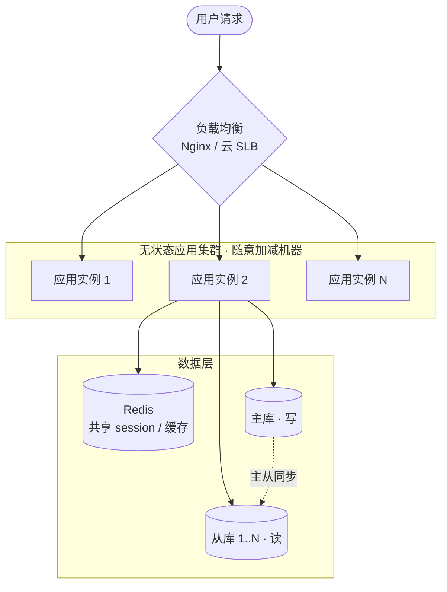

# 可扩展性设计:怎么让系统加机器就能扛更多

> 业务一涨,单机迟早到顶——CPU 跑满、内存吃光、连接数撑爆。这时候有两条路:要么把这台机器换成更猛的,要么再搬几台一样的机器上来一起扛。前者总有物理上限,后者理论上可以一直加下去。
>
> **好架构的标志之一,就是"加机器就能线性扛更多"**——这就是可扩展性(Scalability)。这篇就拆开看:为什么"加机器"才是长久之计、加机器的前提条件是什么、请求怎么分到多台机器上、以及最难啃的数据层怎么扩。这一篇对应《架构演进》开篇地图里"用户变多 → 应用集群 + 负载均衡"那一格,把它讲透。

---

先上一张全景——这一篇要搭的,就是下面这套"加机器就能扛更多"的架构:用户请求先过**负载均衡**,分给一堆**无状态应用实例**,后面接**共享缓存**和**读写分离的数据层**。后面几节就顺着这张图逐层拆开。

## 一、垂直扩展 vs 水平扩展:升配还是加机器

**是什么。** 面对"单机扛不住",业界有两种最基本的扩展方向,名字很对仗:

| 方向 | 英文 | 做法 | 俗称 |
|---|---|---|---|
| **垂直扩展** | Scale Up | 给同一台机器升配:加 CPU、加内存、换更快的磁盘 | 把机器"养肥" |
| **水平扩展** | Scale Out | 加更多同样规格的机器,一起分担 | 把机器"养多" |

一句话点破:**垂直是让一台更强,水平是让多台一起上。**

**为什么水平扩展才是长久之计。** 垂直扩展上手最简单——不用改代码,云控制台上把规格往上调一档就行,所以早期顶一阵很划算。但它有两个躲不开的天花板:一是**物理上限**,单台机器的 CPU 核数、内存条数总有极限,再有钱也买不到"无限强"的一台;二是**成本曲线陡**,配置越往高端走,价格越不是线性涨,顶配机器往往贵得离谱,性价比急剧下滑。更要命的是,**单台机器再强,它挂了就是全挂**——垂直扩展天然和高可用是矛盾的。

水平扩展则相反:理论上你想扛多少流量,就加多少台普通机器,容量随机器数量近似**线性增长**;而且多台之间天然互为备份,挂一台还有别的顶着。代价是**复杂度**——多台机器之间怎么协调、状态放哪、请求怎么分,都是新问题,后面几节就是在解决这些。

**实际业务场景。** 一个典型的成长路径:产品早期流量小,单台 8 核 16G 够用;流量涨了,先升到 16 核 32G(垂直,省事);再涨,发现单台已经到了云厂商能给的较高规格、再升一档价格翻倍还不止——这时候就该转向水平,把应用部署成**多台一样的机器组成的集群**,前面架个负载均衡分流。**绝大多数互联网系统最终都走上了水平扩展这条路**,垂直扩展更多是"早期过渡"和"临时救急"的手段。

**注意事项。** 水平扩展不是"想加就能加"的——**它有一个硬前提:系统得拆得开、加进来的机器能真正分担压力**。如果你的服务把用户状态存在了本地内存里(比如登录态就记在这台机器上),那加机器根本没用:请求落到新机器上,它不认识这个用户。所以水平扩展的第一道门槛,是下一节要讲的**无状态设计**。

## 二、无状态设计:水平扩展的前提

**是什么。** **无状态(Stateless)**指的是:**一台服务实例不在本地保存"跨请求要用的状态"**——它处理完一个请求,不在自己内存或本地磁盘上留下"下次请求还得靠它"的东西。同样一个请求,发给集群里**任意一台**机器,得到的结果都一样。

反过来,**有状态(Stateful)**就是把状态记在了本地:这台机器内存里存着张三的登录态、购物车、上传到一半的文件……于是张三的后续请求**必须**回到这台机器才认得。

**为什么无状态是水平扩展的前提。** 关键就一句话:**有状态,机器就没法随便加和减。**

- **加机器没用**:新加的机器是"空白"的,不持有任何用户状态,请求落上去就出错(找不到登录态、购物车空了)。
- **请求被迫绑死**:为了让有状态服务能用,你不得不让"同一个用户的请求永远路由到同一台机器"(这叫**会话保持 / 粘滞会话**)。可一旦绑死,这台机器一挂,挂在它上面的所有用户状态全丢;扩缩容时流量也没法均匀重新分配。
- **减机器要命**:想缩容下线一台,它内存里那些用户的状态怎么办?

而**无状态**让每台机器都是"平等且可替换"的——请求爱落哪台落哪台,挂一台、加一台、减一台,对用户都无感。这才是"加机器就能线性扛更多"能成立的根基。

**实际业务场景。** 最经典的就是**登录态(session)**。早期单机时代,session 默认就存在应用进程的本地内存里——单机没问题。可一旦做成多台集群,问题立刻暴露:张三在 A 机器登录,session 记在 A 上;下一个请求被负载均衡分到了 B 机器,B 不认识他,直接把他当成未登录踢去登录页。

业界的标准解法是**把状态从本地"外置"出去,挪到一个所有机器都能访问的共享存储**——session 最常见的去处就是 **Redis**。每台应用机器都不再自己存 session,而是统一去 Redis 读写。这样应用层就彻底无状态了,加减机器随意。这一点正好接上《[缓存](../01-data/02-caching.md)》篇讲的 Redis"**短命数据的主存储**"角色:session 本就短命、超高频读、不需要数据库副本,天生适合放 Redis(带 TTL,过期自动清)。

**注意事项。** 无状态最大的陷阱是**那些藏起来的本地状态**,你以为无状态了,其实没有:

- **本地文件**:用户上传的图片、生成的报表直接写在了本机磁盘上 → 下次请求换台机器就读不到。解法:挪到**对象存储**(如 AWS S3、阿里云 OSS)或共享文件系统。
- **本地内存缓存**:为了快,在进程内存里缓存了一份数据 → 多台机器各缓存各的,数据不一致。解法:用**分布式缓存**(Redis)统一,或接受并管理好这份不一致。
- **定时任务 / 长连接**:每台机器都跑了同一个定时任务 → 任务被重复执行 N 次。这类"单例"逻辑得单独拎出来处理(分布式锁、专门的调度服务等)。

**判断标准很简单:把任意一台机器随时拔掉,用户会不会受影响?** 会,就说明还有状态藏在本地没清干净。

## 三、负载均衡:把请求分到多台机器上

**是什么。** 应用做成无状态、部署成多台之后,马上有个现实问题:**用户的请求,到底发给哪一台?** 总不能让用户自己挑。**负载均衡(Load Balancing)**就是干这事的——在用户和后端机器集群之间架一个"分发器(负载均衡器)",它对外是一个统一入口,对内把涌进来的请求**按某种策略分摊**到后端的多台机器上,让大家压力尽量均匀。

**为什么(它在水平扩展里的位置)。** 没有负载均衡,水平扩展就是一句空话:机器加了一堆,但没有一个东西负责把流量分下去,等于白加。负载均衡器是整个"加机器扛更多"链条里**承上启下的那一环**——上承用户的统一入口,下接可随意增减的无状态机器集群。

**业界怎么做。** 这块开源和云方案都非常成熟,选型时大致认这几类:

| 类别 | 代表 | 特点 |
|---|---|---|
| **软件负载均衡** | Nginx、HAProxy | 应用层(七层)主力,功能丰富、配置灵活,最常用 |
| **更底层的软件** | LVS | 工作在网络层(四层),性能极高,常扛在 Nginx 前面做第一道分流 |
| **云厂商托管** | AWS 的 ELB / ALB / NLB、阿里云 SLB | 开箱即用、自带高可用和弹性,云上业务首选,免去自己运维 |

这里有两个绕不开的基础概念:

**① 四层 vs 七层。** 这是按它"看得懂请求的哪一层"来分的:

- **四层(L4)**:只看 IP + 端口(传输层 TCP/UDP),不拆开看请求内容。**快**,因为不解析应用层数据;但**分发能力"粗"**,没法按 URL、按域名做精细路由。代表:LVS、云 NLB。
- **七层(L7)**:能看懂 HTTP 内容(URL、Header、Cookie),可以"按 `/api/` 走一组、按 `/static/` 走另一组"这样精细分发,还能顺手做 SSL 卸载、改写请求。**功能强但开销略大**。代表:Nginx、ALB。

一句话:**四层快而粗,七层细而全;实际架构里两者常常叠着用**(LVS 在前做四层分流,Nginx 在后做七层路由)。

**② 分发策略(把请求分给谁)。** 常见几种,各有适用场景:

| 策略 | 怎么分 | 适合 |
|---|---|---|
| **轮询(Round Robin)** | 一台一个,轮着来 | 后端机器配置一致时,最简单公平 |
| **加权轮询** | 按权重分,配置高的机器多分 | 机器配置不均时 |
| **最少连接(Least Connections)** | 谁手上连接少就给谁 | 请求处理耗时差异大时,更能避免某台过载 |
| **一致性哈希** | 按某个 key(如用户 ID)哈希到固定机器 | 需要"同一来源尽量落同一台"时(如就近利用缓存) |

**注意事项。**

- **健康检查是命根子。** 负载均衡器必须持续探活(定时发心跳/请求),**自动把挂掉的机器从分发列表里摘除**,否则它会傻乎乎地继续往一台已经宕机的机器上转发请求,用户就报错了。这是负载均衡高可用的核心机制。
- **会话保持(粘滞会话)是个取舍,能不用就不用。** 前面说的"同一用户绑同一台",负载均衡器是支持的(基于 Cookie / IP 哈希)。但它会**破坏无状态带来的均匀分配和可替换性**——绑定的那台一挂,用户状态全丢。所以业界更推荐的姿势是:**别靠会话保持,而是把状态外置(回到第二节的无状态设计)**,让负载均衡可以纯粹无脑分发。会话保持只在状态实在没法外置时才退而求其次。
- **负载均衡器自己别成单点。** 它是流量的总闸,自己一旦挂了就全站不可用。所以生产环境的负载均衡器本身也要做高可用(主备 / 集群),云厂商的托管 SLB 一般默认就帮你做好了这层。

## 四、数据层的扩展:无状态搞不定的硬骨头

**是什么。** 前面三节把**应用层**扩展讲明白了:无状态 + 负载均衡,应用机器随便加。但有个东西天生加不动——**数据库**。数据库**就是用来存状态的**,它是整个系统里最有状态、也最难水平扩展的一层。应用层加机器是"复制一份一样的",数据库加机器却面临一个本质难题:**数据怎么在多台之间切分、又不互相冲突。**

**为什么数据层更难。** 应用机器是无状态的、彼此等价,复制 N 份毫无负担;但数据是**唯一且要保证一致**的——你不能简单地把数据库复制十份了事,那十份之间怎么保证一致?所以数据层的扩展,得**读和写分开对付**,因为它俩的瓶颈和解法完全不同。

**实际业务场景:读怎么扩。** 绝大多数业务都是**读远多于写**(刷商品、看订单的人,比下单的人多得多)。所以读的扩展相对好办,两板斧:

- **缓存**:把热点数据放 Redis 挡在数据库前面,大部分读请求根本到不了数据库——这是性价比最高的一招,详见《[缓存](../01-data/02-caching.md)》篇。
- **读写分离(一主多从)**:数据库部署成"一个主库 + 多个从库",**写都走主库,读分摊到多个从库**。读压力大了就加从库,读这一侧就这么水平扩展开了。代价是**主从同步有延迟**——刚写进主库的数据,从库可能晚几毫秒到几十毫秒才同步到,这期间从库读到的是旧值(《架构演进》篇提到的"主从延迟",高可用篇会展开)。

**实际业务场景:写怎么扩。** 写只能落主库,单个主库总有上限;数据量大到单表/单库装不下时,读写分离也救不了。这时候要上**分库分表 / 分片(Sharding)**:**把一张大表的数据,按某个规则水平切成多份,分散到多个库/多张表里**,每个分片只存一部分数据、只扛一部分写。常见切分规则:

- **按范围(Range)**:比如用户 ID 1~100 万放分片 A,100 万~200 万放分片 B。简单,但容易冷热不均(新数据全挤在最后一个分片)。
- **按哈希(Hash)**:对分片键(如用户 ID)取哈希再取模,均匀打散。分布均匀,但**加减分片时是个大麻烦**——下面就说。

**一致性哈希:解决"加减节点时数据怎么少搬"。** 普通哈希分片有个致命问题:用 `hash(key) % N`(N 是机器数)来定位数据,一旦 **N 变了**(加一台或挂一台),几乎**所有 key 的归属都会变**,意味着要把海量数据在机器间大搬家,代价巨大、期间还可能不可用。**一致性哈希(Consistent Hashing)**就是来治这个的:它把哈希空间想象成一个**环**,机器和数据都映射到环上,数据归给"顺时针方向遇到的第一台机器"。这样**加减一台机器时,只影响环上相邻的一小段数据**,绝大部分 key 的归属不变,需要搬的数据量从"几乎全部"降到"一小部分"。所以**一致性哈希在分布式缓存(如 Redis 集群)、分片存储里被广泛采用**,本质是为水平扩展(增减节点)而生的。

**注意事项。**

- **分片是"开弓没有回头箭"的重活,能不分尽量晚分。** 一旦分库分表,**跨分片查询、跨分片事务、跨分片聚合统计都变得极其麻烦**(数据散在多个库,一个 `JOIN`、一个 `COUNT` 都可能要查所有分片再合并)。所以业界共识是:**先用缓存 + 读写分离顶,真到单库扛不住了再分片**,别提前给自己上难度。
- **分片键(Sharding Key)的选择决定生死。** 选不好会导致数据倾斜(某个分片特别大)或大量跨分片查询。一般选**最高频的查询维度**(如电商按用户 ID 分),让绝大多数查询能落在单个分片内。
- **读写分离要容忍主从延迟。** 对"写完立刻要读到最新值"的场景(如下单后立刻查订单),要么强制读主库,要么在业务上容忍这点延迟,不能想当然以为从库永远是最新的。

## 五、AI 推理服务怎么扩

可扩展性这套(无状态 + 负载均衡 + 水平扩)放到 AI 推理服务上,大框架完全通用,但有几处不一样值得拎出来:

- **算的是 GPU,不是 CPU。** 普通服务加的是 CPU 机器,推理服务加的是**带 GPU 的实例**——又贵又紧俏。所以弹性伸缩(按流量自动加减机器)对它格外重要:高峰扩、低谷缩,省的是真金白银。
- **天生适合无状态。** 一次推理就是"输入 → 输出",模型权重是只读的、不随请求改变,实例之间完全等价——正好是无状态的理想形态,水平扩起来很顺。要外置的状态是**对话历史**(多轮上下文),通常存 Redis 或随请求带上,而不是赖在某台机器内存里。
- **负载均衡看的指标不一样。** 普通服务按连接数 / CPU 分流;推理请求耗时差异极大(生成 10 个字和 1000 个字差很多),更适合按**当前在跑的请求数 / GPU 利用率**分,别把一台 GPU 塞爆而另一台闲着。
- **冷启动是新麻烦。** 一个推理实例启动要把几个 GB 的模型权重加载进显存,慢则几十秒——这让"突发流量来了立刻扩一台顶上"没那么灵,得靠预留一定余量或提前预热实例来缓冲。

## 六、一张表:可扩展性手段全景

把全文收进一张表——分应用层和数据层两条线,各自的手段、方案和要当心的代价:

| 层次 | 扩展手段 | 主流方案 | 注意事项 / 代价 |
|---|---|---|---|
| **思路** | 优先水平扩展(Scale Out) | 加同规格机器组集群 | 垂直扩展有物理上限、成本陡、单点;水平是长久之计 |
| **应用层** | 无状态设计 | session 等状态外置到 Redis | 警惕本地文件 / 本地内存缓存 / 定时任务等隐藏状态 |
| **应用层** | 负载均衡 | Nginx、LVS、HAProxy、云 SLB/ALB | 健康检查必做;会话保持是退路,优先靠无状态 |
| **数据层(读)** | 缓存 | Redis、Memcached | 一致性问题(见《缓存》篇) |
| **数据层(读)** | 读写分离(一主多从) | 主库写、从库读,加从库扩读 | 主从同步延迟,写后立刻读要走主库 |
| **数据层(写)** | 分库分表 / 分片 | 按范围 / 哈希切分 | 跨分片查询/事务难;能晚分就晚分;分片键要选好 |
| **数据层(扩缩容)** | 一致性哈希 | Redis 集群、分片存储 | 加减节点只搬一小部分数据,而非全量重排 |

**一条主线串起来**:水平扩展是方向 → 无状态让应用层加得动机器 → 负载均衡把流量分下去 → 数据层才是真正的硬骨头,读靠缓存 + 读写分离、写靠分片、增减节点靠一致性哈希。**应用层的"加机器就能扛"相对容易,数据层的扩展才是架构的深水区。**

---

## 名词解释

- **可扩展性(Scalability)**:系统通过增加资源(尤其是机器)来提升承载能力的能力。理想状态是"加机器就能线性扛更多"。
- **垂直扩展(Scale Up)**:给单台机器升配(加 CPU / 内存)。简单但有物理上限、成本陡、且单点不可用。
- **水平扩展(Scale Out)**:增加同规格机器一起分担。容量近似线性增长、天然冗余,是长久之计,代价是复杂度。
- **无状态(Stateless)**:服务实例不在本地保存跨请求的状态,请求发给任意一台机器结果一致——水平扩展的前提。
- **有状态(Stateful)**:把状态(登录态、购物车等)存在了本地,导致请求必须路由回固定机器,加减机器困难。
- **状态外置**:把本地状态挪到所有机器都能访问的共享存储(如 session 放 Redis、文件放对象存储),让应用层变无状态。
- **负载均衡(Load Balancing)**:在用户和机器集群之间分发请求的机制,常见 Nginx / LVS / HAProxy / 云 SLB。
- **四层负载均衡(L4)**:只按 IP + 端口转发,不解析应用层内容,快但粗(如 LVS)。
- **七层负载均衡(L7)**:能解析 HTTP 内容(URL / Header),可精细路由,功能强但开销略大(如 Nginx)。
- **分发策略**:决定请求给哪台机器的算法,如轮询、加权轮询、最少连接、一致性哈希。
- **健康检查**:负载均衡器定时探活后端机器,自动摘除挂掉的实例,避免把请求转给宕机机器。
- **会话保持(粘滞会话 / Session Sticky)**:让同一用户的请求固定路由到同一台机器;能用但会破坏无状态优势,优先用状态外置替代。
- **读写分离(一主多从)**:写走主库、读分摊到多个从库,加从库即可扩展读能力;代价是主从同步延迟。
- **分库分表 / 分片(Sharding)**:把一张大表的数据按规则(范围 / 哈希)水平切分到多个库 / 表,分散读写压力;跨分片查询和事务困难。
- **分片键(Sharding Key)**:决定数据落到哪个分片的字段,通常选最高频的查询维度;选不好会数据倾斜或大量跨分片查询。
- **一致性哈希(Consistent Hashing)**:把机器和数据映射到一个哈希环上,增减节点时只需搬动相邻一小段数据,而非全量重排;广泛用于分布式缓存与分片存储。

---

> 本文属《研发都要懂的事》·**服务端架构设计**系列,对应《[架构设计到底在设计什么](./01-architecture-overview.md)》开篇地图里"用户变多 → 应用集群 + 负载均衡"那一格的展开。涉及的缓存、读写分离细节见《[缓存](../01-data/02-caching.md)》篇;主从延迟、负载均衡器高可用等留给后面的高可用篇深入。
