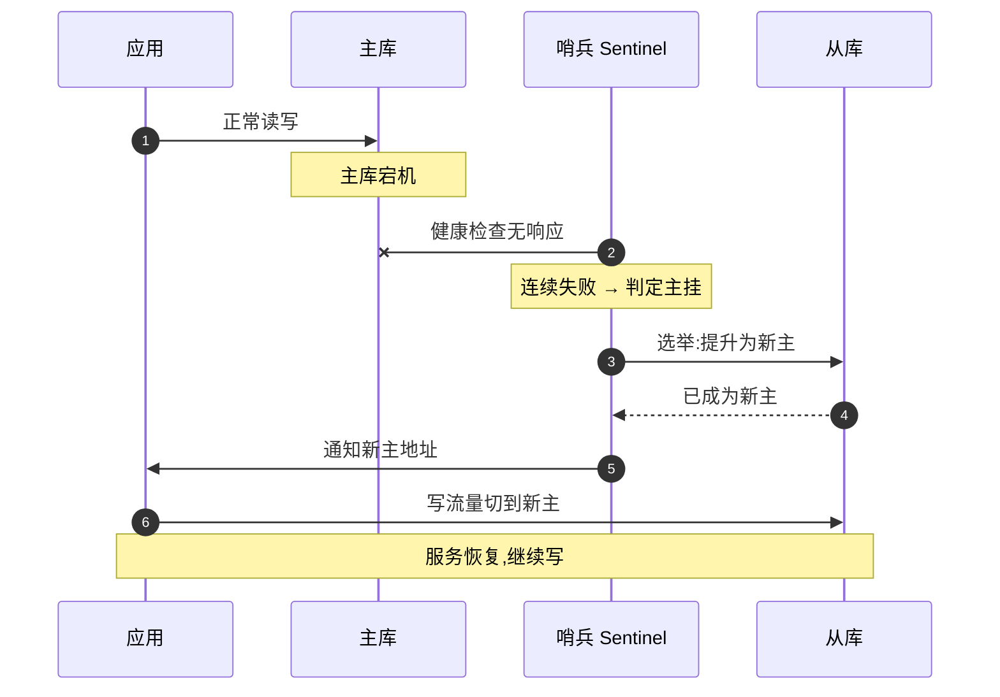

# 高可用设计 —— 怎么让系统尽量不宕机

> 用户其实不太关心你的架构画得多漂亮、用了多时髦的技术栈,他只关心一件事:**我点进去,能不能用?** 一个再优雅的系统,一年崩个十几次、每次半小时,用户照样跑光。所谓**高可用(High Availability)**,说白了就是想尽办法让系统**少宕机,宕了也能快速恢复**——而"到底有多稳",业界习惯用"几个 9"来量。
>
> 这是《服务端架构设计》系列里专门讲"稳不稳"的一篇。我补这块时,最大的认知翻转是:高可用不是某个开关、某个中间件,而是一整套**假设"什么都会坏"、然后给每个会坏的地方都准备一手后路**的设计思路。下面就把这套思路拆开看。

---

## 一、可用性怎么量:几个 9 是什么意思

**是什么。** 可用性(Availability)就是**系统正常服务的时间占总时间的比例**。业界几乎不用"很稳""偶尔崩"这种模糊词,而是用一个百分比,口语里叫"几个 9"——99.9% 是"三个 9",99.99% 是"四个 9",以此类推。9 越多,越稳。

把百分比换算成"一年到底能宕机多久",体感会清晰很多:

| 可用性 | 叫法 | 全年允许宕机时间(约) |
|---|---|---|
| 99% | 两个 9 | **3.65 天** |
| 99.9% | 三个 9 | **8.76 小时** |
| 99.99% | 四个 9 | **52.6 分钟** |
| 99.999% | 五个 9 | **5.26 分钟** |

**为什么要量化。** 一句话点破:**没有指标,就没法谈高可用,也没法做取舍。** "我们系统挺稳的"——稳到几个 9?这直接决定了你要砸多少钱、用多复杂的方案。从三个 9 到四个 9,看着只多一个 9,背后却往往是"加一倍的机器 + 多机房 + 自动切换"的工程量。所以可用性通常会写进 **SLA**(服务等级协议)——对内是团队的目标,对外是给客户的承诺,达不到甚至要赔钱。

**注意一个常被忽略的点:可用性是会"连乘"的。** 如果一个请求要串行经过 A、B、C 三个服务,每个都是 99.9%,那整条链路的可用性是 0.999³ ≈ **99.7%**,反而更低了。所以微服务越拆越多,单点的稳定性要求其实越高——这也是后面"消除单点"的伏笔。

## 二、核心思路一:消除单点(冗余)

**是什么。** **单点故障(SPOF,Single Point of Failure)**指系统里某个环节**只有一个**,它一挂,整个系统跟着挂。高可用的第一原则,就是**别让任何一个环节是"独苗"**——给它准备副本,这就是**冗余(Redundancy)**。思路朴素到像废话:**重要的东西,多备一份。**

**为什么。** 因为硬件、网络、进程**一定会坏**,这不是"会不会"而是"什么时候"的问题。机器会宕、磁盘会坏、网线会被挖断、进程会 OOM。你没法让单个组件永不出错,但可以让"一个坏了,还有别的顶上"。冗余就是把"单点必挂"变成"挂一个不影响整体"。

**实际业务场景。** 一个典型 Web 系统,从入口到底层,每一层都要消除单点:

- **应用层:多实例。** 同一个应用部署多台,前面架**负载均衡**(Nginx / LVS / 云 SLB)把流量分发下去,挂一台,流量自动打到其他台。
- **数据库层:主从复制。** 一主多从,数据实时同步到从库;主库挂了,从库还在,数据不会只压在一台机器上。
- **负载均衡器本身也别是单点。** 很多人给应用做了多实例,却忘了前面那台负载均衡器才是真正的"独苗"——它一挂全完。所以入口层通常也要做成"多活"或主备。

**业界怎么做。** 冗余是几乎所有中间件的内置能力,选型时大致认这些:

| 层次 | 冗余 / 集群方案(主流开源 / 标准) |
|---|---|
| 应用 | 无状态应用 + 多实例 + 负载均衡(Nginx / HAProxy / 云 SLB) |
| 缓存 | Redis 主从、Redis Cluster(分片 + 副本) |
| 关系数据库 | MySQL / PostgreSQL 主从复制、组复制(MGR)、Patroni |
| 消息队列 | Kafka 多副本(replication factor)、RabbitMQ 镜像 / Quorum 队列 |
| 协调服务 | ZooKeeper / etcd 集群(多数派) |

**注意事项。** 最容易翻车的是**识别隐藏的单点**。常见的"以为冗余了、其实没有":多台应用都连同一个 Redis、同一个数据库主库;多台机器插在同一个机柜、同一个交换机、同一路市电上;甚至多个实例用了同一份会改的配置或同一个证书。**冗余的前提是应用"无状态"**——会话、文件别存在某台机器的本地内存 / 磁盘上,否则那台一挂,它身上的状态就丢了,这也是为什么会话常被挪到 Redis(可接《缓存》篇的"短命数据主存储")。

## 三、核心思路二:故障转移(Failover)

**是什么。** 光有冗余还不够——副本备在那儿,**得有人在出事时把流量切过去**,而且最好是**自动切**。**故障转移(Failover)**就是:**检测到某个节点挂了,自动把它的角色 / 流量转移到健康的备用节点上**,中间不用人半夜爬起来手动操作。它和冗余是一对:冗余解决"有没有后路",故障转移解决"出事时能不能自动走上后路"。

**为什么。** 因为**故障发生在任何时刻,而人的反应是有延迟的**。如果主库半夜挂了要等人收到告警、登录、手动切换,这中间系统已经躺了几十分钟——三个 9 的预算一次就花光了。自动故障转移把"恢复时间"从"分钟级人工"压到"秒级自动",这正是高可用的核心战场。

**实际业务场景。**

- **数据库主挂切从:** 主库宕机,系统自动从从库里**选一个提升为新主**,应用的写流量指向新主,服务继续。
- **缓存哨兵选主:** Redis 主节点挂了,**哨兵(Sentinel)** 集群发现后自动选出新主并通知客户端切换。
- **负载均衡健康检查摘除坏节点:** 负载均衡器定期给每个后端发**健康检查**(心跳 / 探活),某台连续探测失败就把它**自动摘除**,不再往上面打流量;恢复了再加回来。

下面这张图,把"主库宕机 → 哨兵自动把流量切到新主"的全过程串起来看:

**业界怎么做。** 自动故障转移基本都靠成熟组件托底:

| 场景 | 主流方案(开源 / 标准) |
|---|---|
| Redis 自动选主 | Redis Sentinel(哨兵)、Redis Cluster |
| MySQL 主从切换 | MHA、Orchestrator、MGR、Patroni(PostgreSQL) |
| 服务器 / 入口 VIP 漂移 | Keepalived(VRRP 协议,主备共享一个虚拟 IP) |
| 后端节点摘除 | 负载均衡健康检查(Nginx / HAProxy / 云 SLB / K8s liveness & readiness 探针) |
| 容器自愈 | Kubernetes:Pod 挂了自动重建、不健康自动重启 |

**注意事项。** 故障转移最危险的两个坑:

- **脑裂(Split-Brain)。** 主从之间网络断了,从库以为主挂了、把自己提成新主,可旧主其实还活着——于是**出现两个主**,双双接收写入,数据从此分叉,合并起来是灾难。业界的解法是引入**多数派(quorum / 仲裁)**:只有拿到超过半数节点投票的一方才能当主,另一方主动退位。这也是为什么 ZooKeeper / etcd 这类协调服务常被部署成奇数台。
- **切换瞬间的数据一致性。** 主从复制有延迟,主库刚写入、还没同步到从库就挂了,切过去的新主可能**少了最后几条数据**。是优先"快速恢复"(可能丢一点点最新数据)还是优先"一条都不能丢"(可能切得更慢甚至需要人工确认),取决于业务——支付、订单这类对数据零容忍的,往往宁可切慢一点。

## 四、核心思路三:多活与容灾

**是什么。** 前面两招防的是"某台机器 / 某个进程坏"。但还有更狠的故障:**整个机房没了**——光纤被挖断、机房断电、甚至火灾。**多活与容灾**就是把冗余从"机器级"拔高到"机房级 / 地域级":

- **同城双活:** 同一座城市的两个机房同时对外服务,一个机房整体挂了,另一个扛住全部流量。
- **异地多活:** 不同城市的多个机房**都在同时服务用户**(不是冷备),既扛容灾,也能就近接入降延迟。这是难度最高的一档。
- **异地容灾备份:** 异地放一套"备份 / 冷备",平时不接流量,主地域整体出事时再启用——成本比多活低,但切换慢、可能丢一段数据。业界常用 **RPO / RTO** 两个指标衡量:**RPO**(能容忍丢多少数据)、**RTO**(能容忍多久恢复)。

**为什么。** 因为**机房级故障虽然罕见,但一旦发生就是"全站归零"**,前面所有的多实例、主从全在同一个机房里,一起陪葬。对一些核心业务来说,"机房全挂"这种小概率事件的代价大到无法承受,所以宁可花大价钱也要让系统**跨机房、跨地域**地活着。

**实际业务场景与业界做法(客观,非推荐)。** 主流云厂商(阿里云、AWS 等)都把基础设施按 **Region(地域)/ AZ(可用区)** 划分,AZ 之间物理隔离、低延迟互联,正是为同城双活、异地多活设计的。很多大型互联网公司公开分享过自己的异地多活实践,核心难点高度一致:**跨地域的数据同步**与**流量路由(单元化)**——把用户按某种维度(如用户 ID)切成"单元",让一个用户的读写尽量闭环在一个机房内,减少跨地域调用。

**注意事项。** 多活是**典型的"用钱和复杂度换可用性"**,坑也最深:

- **成本高。** 双活意味着至少两套机房同时跑、容量都得能扛全量,机器成本接近翻倍。
- **数据同步延迟与冲突。** 跨地域几十毫秒的网络延迟下,两地同时写同一条数据怎么处理冲突?异地多活最硬的骨头就在这——它逼着你直面分布式系统的一致性问题(可接后续"分布式"篇)。
- **按业务重要性取舍,别一刀切。** 不是所有业务都值得做异地多活。常见做法是**分级**:核心交易链路做多活,边缘的、可降级的业务做冷备甚至不做。脱离业务谈"要不要上异地多活",和脱离业务谈"要不要上微服务"一样,答案都是"看情况"。

## 五、核心思路四:故障时的兜底与主动找茬

前三招努力让系统"别挂";但工程上有个清醒的共识:**故障不可能完全消灭,只能控制它的影响范围。** 所以高可用还有最后两块拼图——**出事时优雅地少死一点**,以及**平时主动把故障演练出来**。

**兜底:限流 / 熔断 / 降级。** 当流量突增或某个依赖变慢,与其让系统被拖垮、彻底宕机(**0 分**),不如**主动牺牲一部分**来保住核心(**60 分活着**):

- **限流**:超过承载能力的请求直接挡掉,保护后端不被打爆;
- **熔断**:某个下游服务一直超时 / 报错,就暂时"跳闸"不再调它,避免调用方被一起拖死(**雪崩**);
- **降级**:非核心功能临时关掉或返回兜底数据(如"推荐"挂了就返回一个默认列表),把资源让给核心链路。

这三招是高并发与高可用共用的"保命手段",细节这里不重复——**展开见《高并发三板斧》篇**。这里只强调一个定位:**它们是高可用的"最后一道防线"**,前面的冗余、故障转移都失效时,靠它们让系统"伤而不死"。

顺带一提,**AI 服务特别吃这套兜底**:大模型慢、贵、还不稳,主模型超时或挂了,常自动**降级到备用 / 更小的模型**(答得糙点也好过直接报错),再不行就返回预设的兜底回复——还是"降级"那一招,只是把"关掉非核心功能"换成了"换个更稳的模型来答"。

**主动找茬:故障演练与混沌工程。** 一个反直觉但很重要的认知:**没演练过的高可用方案,等于没有。** 你写了主从自动切换,但从没真切过——真出事那天,谁也不敢保证它能切成功。于是业界发展出**混沌工程(Chaos Engineering)**:**主动地、有控制地往生产或类生产环境注入故障**(随机杀进程、断网、注入延迟),看系统是不是真能像设计的那样自愈,在演练里暴露问题,而不是在真事故里。

**业界怎么做(客观,非推荐)。** 混沌工程的标志性思路来自 Netflix 公开的 **Chaos Monkey**——一只"捣乱的猴子",在工作时间随机关掉生产环境里的实例,逼着工程师把系统设计成"任何一台随时挂掉都没事"。这套思路后来被开源社区延续成更完整的工具,如 **Chaos Mesh**、**Litmus**(常配合 Kubernetes)。注意它们是**主动验证手段**,落地前提是先有完善的监控告警和快速回滚能力(可接《可观测性》篇)——否则演练本身就可能演成真事故。

## 六、一张表:高可用手段速查

把全文收进一张表,横着看就是一套"从机器级到机房级、从被动防御到主动找茬"的递进:

| 手段 | 解决什么问题 | 典型方案(主流 / 客观) | 注意 |
|---|---|---|---|
| **冗余(消除单点)** | 单点一挂、全站跟着挂 | 应用多实例 + 负载均衡;DB 主从;Redis 集群 | 识别隐藏单点;应用要无状态;别都堆一个机柜 |
| **故障转移(Failover)** | 出事时能否自动切到备用 | Sentinel、MHA、Keepalived、健康检查、K8s 自愈 | 防脑裂(多数派仲裁);切换瞬间可能丢最新数据 |
| **多活 / 容灾** | 整个机房 / 地域级故障 | 同城双活、异地多活、异地冷备(云 Region / AZ) | 成本高、跨地域同步难;按业务重要性分级 |
| **限流 / 熔断 / 降级** | 扛不住时别整体崩(伤而不死) | 见《高并发三板斧》篇 | 是最后一道防线;要预先想好降级策略 |
| **混沌工程(演练)** | 方案到底有没有用 | Chaos Monkey 思路、Chaos Mesh、Litmus | 先有监控和回滚;从小范围、非高峰起步 |

一句话收尾:**高可用不是"造一个永不出错的系统"——那不存在——而是假设"什么都会坏",再给每一处会坏的地方都留好后路。**

---

## 名词解释

- **高可用(HA,High Availability)**:通过冗余、故障转移等手段,让系统尽量少宕机、宕了也能快速恢复的设计目标。
- **可用性 / 几个 9**:系统正常服务时间占总时间的比例,如 99.99%(四个 9,全年宕机约 52 分钟);9 越多越稳。
- **SLA(服务等级协议)**:对可用性等指标的承诺,对内是目标、对外是承诺,通常约定达不到的后果。
- **单点故障(SPOF)**:系统中某个只有一份的环节,它一挂,整个系统跟着挂。
- **冗余(Redundancy)**:给关键环节准备副本(多实例、主从),让"挂一个"不影响整体。
- **无状态(Stateless)**:应用不在本地存会话 / 文件等状态,任意实例可互相替代——是做冗余和扩容的前提。
- **负载均衡(Load Balancing)**:把请求分发到多台后端,常见 Nginx / LVS / 云 SLB,并能摘除坏节点。
- **主从复制(Master-Slave Replication)**:数据从主库实时同步到从库;主挂时从库可顶上,但同步有延迟。
- **故障转移(Failover)**:检测到节点故障后,自动把角色 / 流量切到健康备用节点的机制。
- **健康检查 / 探活(Health Check)**:负载均衡或编排系统定期探测后端是否存活,失败则自动摘除。
- **哨兵(Sentinel)**:Redis 的高可用组件,监控主从、自动选主并通知客户端切换。
- **Keepalived / VRRP**:让主备节点共享一个虚拟 IP(VIP),主挂时 VIP 自动"漂移"到备机。
- **脑裂(Split-Brain)**:网络分区导致出现两个"主"、各自接收写入、数据分叉的故障;靠多数派仲裁避免。
- **多数派 / 仲裁(Quorum)**:只有获得超过半数节点同意的一方才能当选主,防止脑裂;故协调服务常部署奇数台。
- **同城双活 / 异地多活**:让多个机房 / 多个地域同时对外服务,抵御机房级、地域级故障;异地多活难度最高。
- **容灾备份(异地冷备)**:异地放一套平时不接流量的备份,主地域整体出事时启用;比多活便宜但切换慢、可能丢数据。
- **RPO / RTO**:容灾两大指标——RPO 是能容忍丢多少数据,RTO 是能容忍多久恢复。
- **Region / AZ(地域 / 可用区)**:云厂商对机房的划分,AZ 间物理隔离、低延迟互联,是多活的基础设施。
- **雪崩(Cascading Failure)**:一个服务变慢 / 挂掉,把调用它的上游连环拖垮的连锁故障;靠熔断阻断。
- **限流 / 熔断 / 降级**:扛不住时主动牺牲一部分保住核心的兜底手段(详见《高并发三板斧》篇)。
- **混沌工程(Chaos Engineering)**:主动、有控制地往系统注入故障,验证它能否真的自愈;代表思路是 Netflix 的 Chaos Monkey。

---

> 本文是《研发都要懂的事》·**服务端架构设计**系列的一篇,对应开篇地图里"高可用(几个 9)"这一格。前置可读《架构设计到底在设计什么》(权衡的全局视角);兜底手段限流 / 熔断 / 降级在《高并发三板斧》篇展开,演练前提的监控告警见《可观测性》篇。
