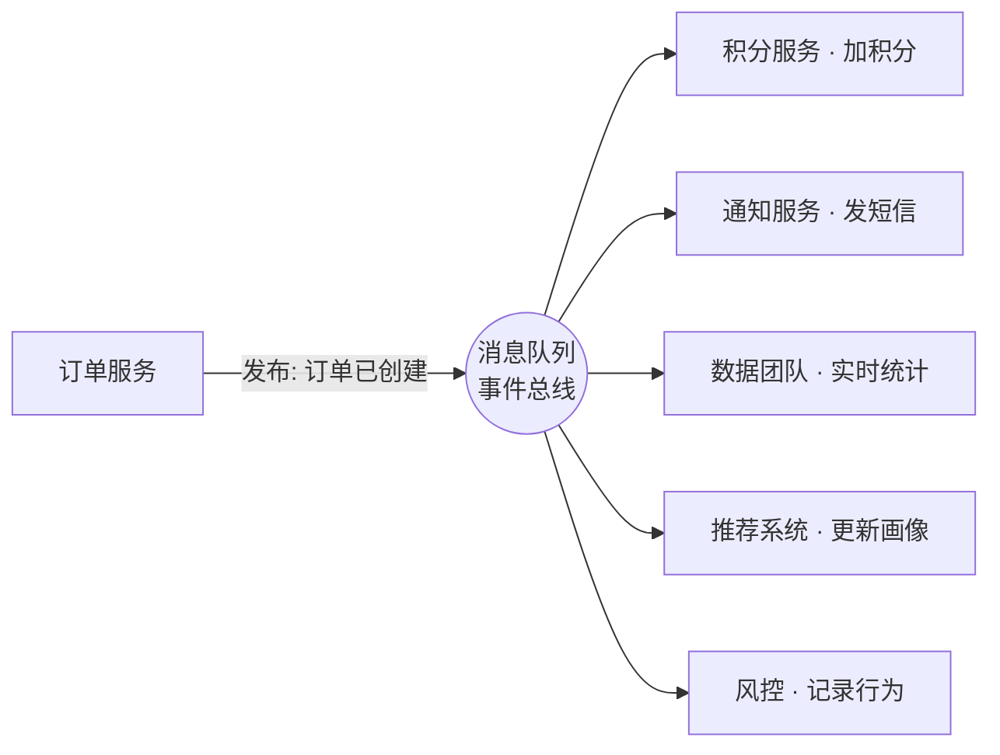

# 异步与事件驱动架构 —— 把系统的协作方式从"打电话"改成"发消息"

> 同步调用像打电话:你拨过去,得**等对方接、等他说完、等他挂**,这期间你干不了别的;只要对方占线或不接,你就一直卡着。异步/事件驱动像发消息:**发出去就走**,对方什么时候看、什么时候回,不耽误你做自己的事。
>
> 系统小的时候,"打电话"式的同步调用最直接;可系统一大、协作方一多,很多环节其实并不需要互相等。这篇是《服务端架构设计》系列里**架构风格**那一层的一篇——不讲某个消息队列组件的丢失/重复/顺序细节(那些在《消息队列》篇里),而是讲一种**架构思想**:用"事件"把整个系统的协作方式,从"我主动去调你、还得等你"改成"我只广播一件已发生的事,谁关心谁自己来"。

---

## 一、是什么:事件驱动架构(EDA)

**是什么。** 事件驱动架构(Event-Driven Architecture,EDA)的核心,是把服务之间的协作方式换了个底层逻辑:**服务之间不直接互相调用,而是把"谁做了什么"发成一个事件,关心这件事的服务自己去订阅。** 一个事件就是一句**陈述过去的事实**——"订单已创建""支付已完成""用户已注册",注意都是过去式,它描述的是**已经发生的事**,而不是"请你去做某件事"的命令。

这里要分清两种截然不同的协作姿势:

| 协作方式 | 调用方知道什么 | 类比 |
|---|---|---|
| **同步调用(命令式)** | 我知道下游是谁、要调它的哪个接口、还得等它返回 | 打电话:拨号、等接、等说完 |
| **事件驱动(发布订阅)** | 我只知道"我发生了一件事",**不认识**任何下游 | 发广播:喊一嗓子,谁听见谁处理 |

**它和《消息队列》篇是什么关系?** 一句话:**消息队列(MQ)是实现事件驱动的基础设施,事件驱动是用 MQ 搭出来的一种架构风格。** MQ 篇讲的是"一根传消息的管子"本身怎么用好——消息怎么不丢、怎么不重复、怎么保证顺序(那是组件层面的事,本篇不重复,要用时直接翻《消息队列》篇);本篇站高一层,讲的是**怎么用"事件 + 订阅"这种思路,去组织整个系统的协作**。你可以把 MQ 理解成"邮局",事件驱动则是"整个城市改用写信而不是当面找人办事"这套**协作约定**。

> 一句话点破:同步调用是"我去找你办事并等你办完";事件驱动是"我只宣布一件已经发生的事,谁关心谁来接"。前者是命令,后者是广播。

## 二、为什么:同步耦合的代价,异步带来的解耦

**为什么要费这个劲改成异步?** 因为**同步调用在系统变大后,会把所有协作方"焊死"在一条链路上**,而这条链路的脆弱程度,等于其中**最慢、最不稳**的那一环。

先看同步耦合到底贵在哪。假设下单后要同步地依次做:扣库存 → 加积分 → 发通知 → 更新统计。这条链有三个绕不开的代价:

- **一处慢,全链路慢。** 用户点完"下单",要一直转圈等到通知也发完才看到成功。其中发通知依赖外部网关,偶尔慢个两三秒,用户的整个下单体验就被这个**最不核心**的环节拖累了。
- **一处挂,全链路挂。** 积分服务宕机,整个下单**跟着失败**——可钱明明已经付了,这是最离谱的:一个非核心下游,有能力否决核心交易。
- **改一处,要动调用方。** 哪天产品说"下单再送一张成长值",你得回到下单代码里加一行调用。下单这段逻辑,被迫**认识**越来越多的下游,列表越来越长。

这正接上《架构设计概览》篇讲的演进主线:**系统长大的过程,本质就是不断在拆耦合。** 异步/事件驱动,就是在"协作方式"这个维度上拆耦合,它一次性带来三样东西(这三样和《消息队列》篇讲的 MQ 三大价值是同一回事,因为 EDA 正是靠 MQ 落地的):

- **解耦**:下单只管发"订单已创建"这一个事件,**不认识任何下游**;新增下游只需让它去订阅,下单代码一个字不改。
- **削峰**:洪峰先堆进队列,下游按自己的节奏慢慢消化,不会被瞬时流量冲垮(削峰填谷的细节见《消息队列》篇)。
- **可扩展**:协作方之间没有硬连线,加消费者、加处理逻辑都是"接上去"而非"改进去",系统更容易横向长大。

> 一句话点破:同步调用把"协作"变成了"一根串起来的链子",链子的强度取决于最弱一环;事件驱动把链子拆成"一个广播 + 各自订阅",一环慢、一环挂,不再连累全局。

## 三、实际业务场景:哪些协作天然适合用"事件"驱动

**什么场景该用。** 一个朴素的判断标准:**当"一件事发生"之后,需要触发一串"互相不依赖、又不要求立刻完成"的后续动作时,就特别适合事件驱动。** 几个典型:

- **下单后的扇出(最经典)。** "订单已创建"这一个事件,会被一堆系统关心:积分服务加分、通知服务发短信、数据团队统计、推荐系统更新画像、风控记录行为……它们**彼此无关、也都不是下单必须等的核心**。用事件驱动:下单只发一次事件,这些系统各自订阅、各干各的,新增一个消费方对下单完全透明。这就是**一个事件、多方订阅**的"扇出(fan-out)"。
- **用户行为事件流。** 用户的点击、浏览、搜索、停留,被打成一条条事件源源不断地流出来,汇成一条**行为事件流**;下游的实时推荐、A/B 实验统计、数据看板各自消费这条流。这类"持续产生、多方消费、还可能要回放重算"的场景,是事件流的主场(它对应《消息队列》篇里讲的**日志型 MQ**,比如 Kafka 那种"读完不删、可按 offset 回放"的存法)。
- **状态变更广播。** 某个核心实体的状态变了——订单从"待支付"变成"已支付"、商品从"在售"变成"下架"、配置项被改了——把这个变更当成事件广播出去,所有缓存、搜索索引、关联服务收到后各自更新自己那一份。这避免了"状态一变,就得挨个去同步调用通知它们"的强耦合。

以最经典的"下单扇出"为例,这一对多的解耦长这样——订单服务只发一次事件,谁关心谁自己订阅:

这里有个共同点值得点破:这些场景里,**事件的生产者根本不关心、也不需要知道有多少消费者**。下单服务不需要知道"今天有几个团队在消费订单事件",这正是事件驱动相比同步调用最舒服的地方——**生产者和消费者在时间上、认知上都解耦了**。

> 一句话点破:凡是"一件事发生后,要触发一串彼此独立、又能容忍晚一点完成的后续",就是事件驱动的甜区;反过来,"必须立刻拿到结果才能往下走"的,就别硬改异步(见第五节)。

## 四、业界怎么做:从消息队列到 CQRS 与事件溯源

**业界主流方案。** 落地事件驱动,业界是分层来搭的:**底层用消息队列当"事件的管道",上层在需要时叠加更进阶的架构模式。**

**第一层:消息队列 / 事件总线(地基)。** 事件靠什么从生产者送到各个订阅者?就是消息队列。主流选择 **Kafka / RabbitMQ / RocketMQ**——它们各自的定位、术语(topic / partition / consumer group)、以及"消息不丢/不重/保序"怎么解决,《消息队列》篇已经讲透,这里不重复。本篇只需记住它们在 EDA 里扮演的角色:**承载事件的发布与订阅**。在 EDA 的语境里,这层也常被叫作**事件总线(Event Bus)**或 Broker——一个让事件"发一次、多方各取所需"的中枢。规模小的时候,事件总线甚至可以是进程内的一个轻量实现;规模上来就换成独立的 MQ 集群。

铺好了地基,事件驱动还衍生出两个更进阶、也更"重"的架构模式,它们不是必选项,而是**解决特定难题时才请出来**的:

**第二层(进阶模式之一):CQRS —— 读写分离架构。**

- **是什么。** CQRS(Command Query Responsibility Segregation,命令查询职责分离)把对数据的操作拆成两条独立的路:**写(命令,Command)走一套模型,读(查询,Query)走另一套模型**,两边的数据结构、甚至存储都可以不一样。
- **解决什么。** 很多系统的读和写,诉求是**冲突**的:写要求严格的事务和一致性,读要求快、要求按各种维度灵活聚合。硬塞在同一套模型/同一个库里,往往两头都别扭。CQRS 让它们各自优化——写库保证数据正确,读库(往往是为查询特意做的"宽表"或搜索引擎)保证查得快。
- **和事件驱动怎么接。** 写端处理完命令后,**发一个事件**;读端订阅这个事件,据此**更新自己那份专供查询的数据**。事件就是连接读写两条路的桥。
- **什么场景用。** 读写比例极度悬殊(比如电商商品详情:写得少、读海量)、或读侧需要复杂聚合/多维检索的场景。**注意它的代价**:读模型是异步更新的,所以读到的可能是**稍旧的数据**(最终一致,见第五节)——这正是 CQRS 最大的取舍。简单的增删改查,**千万别上 CQRS**,纯属给自己加复杂度。

**第三层(进阶模式之二):Event Sourcing —— 事件溯源。**

- **是什么。** 传统做法是数据库里只存**当前状态**(账户余额是 100)。事件溯源反过来:**不存当前状态,而是把"导致状态变化的每一个事件"按顺序完整存下来**(存了 5 笔交易事件),当前余额是把这些事件**依次重放**算出来的。换句话说,**事件流本身才是唯一可信的事实来源(source of truth)**,当前状态只是它的一个"快照"。
- **解决什么。** 它天然带来一份**完整、不可篡改的历史账本**:任何时刻的状态都能由事件重算出来,且能回答"它是怎么变成现在这样的"。这对**审计、对账、可追溯**要求极高的领域是刚需。
- **什么场景用。** 金融账务、订单状态机、需要完整审计轨迹的业务,是它的典型领域。**但它非常重**:查询当前状态要重放事件(常配合 CQRS,用读模型存快照来缓解)、历史事件的结构一旦变了迁移很麻烦、整个团队的心智模型也得跟着变。**绝大多数 CRUD 业务都不需要事件溯源**,它是"重武器",请之前务必想清楚值不值。

> 一句话点破:消息队列是事件驱动的**地基**(几乎都要),CQRS 和事件溯源是**进阶选配**——前者解决"读写诉求冲突",后者解决"要完整历史与可追溯";两者都强大,但都很重,不是标配,别为了"听起来高级"而上。

## 五、注意事项:异步不是免费的

**几个绕不开的坑。** 把同步改成异步,换来了解耦和弹性,但它**绝不是免费的**——下面这些代价,是引入事件驱动前就该想清楚的:

- **最终一致,不是强一致。** 这是异步的**天性**,不是 bug。下单事件发出去后,积分、统计是"晚一会儿"才更新完的,这中间存在一个**短暂的不一致窗口**——余额可能比积分先到。业务上必须能接受"过一会儿就对了"(这就是**最终一致性**)。如果某个环节要求**强一致、立刻一致**(比如扣款和扣库存必须同生共死),那它就不该被拆成异步事件,得留在同步事务里。**别把强一致的核心链路,错改成最终一致的异步流程。**
- **事件顺序与幂等,躲不掉。** 异步意味着事件可能**乱序到达、也可能重复投递**——消费端必须做**幂等**(同一个事件处理一次和处理多次,结果一样),需要保序的还得想办法路由到同一分区。这些**怎么做**,《消息队列》篇已经讲细(唯一业务 id + 去重表、同 key 同分区),本篇只强调一点:**这是 EDA 的"配套义务",不是可选项**——你选了异步,就得连这些一起接下。
- **调试和排查会变难。** 同步调用栈是一条直线,报错顺着栈一路能看到底;事件驱动是"发出去就断了",一个业务流程被打散到多个服务、多次异步消费里,**线索是断的**——出了问题,你很难一眼看出"这个事件到底被谁消费了、卡在哪一环"。所以**事件驱动几乎是强制要求配链路追踪的**:靠一个贯穿全流程的 traceId 把散落各处的处理串起来(这正是《可观测性》篇讲的 Tracing)。没有可观测性兜底,异步系统出了事就是大海捞针。
- **别为异步而异步。** 这是最该记住的一条。事件驱动给系统增加了一个要独立运维的中间件、一套最终一致的心智负担、以及幂等/排查这些额外工程量。**如果你的系统调用链很短、协作方就一两个、又需要同步拿结果,那简单的同步调用就是最优解**,硬上事件驱动是拿大炮打蚊子(这和《架构设计概览》篇说的"过度设计是更隐蔽的坑"是一个道理)。**上之前先问:真有需要解耦/削峰/扇出的痛点吗?能接受最终一致吗?** 都是 yes,才值得。

> 一句话点破:异步用"最终一致 + 排查变难 + 一套幂等义务"换来了"解耦 + 弹性"。这笔交易在系统够大、协作够多时很划算;在系统还小、链路还短时,纯属负担。

## 六、AI 任务为什么几乎必须异步

AI 生成类任务(文生图、长文本、视频生成、批量处理)有个共性:**慢**——快则几秒,慢则几十秒甚至上分钟。要是让用户同步等着,HTTP 连接长时间挂着、随时可能超时,体验也差。所以 AI 应用几乎天然要走异步这一套:

- **提交即返回。** 用户提交任务,服务端丢进队列、立刻返回一个任务 ID,不让用户干等;后台的 worker(往往就是那批抢 GPU 的机器)从队列里取任务慢慢跑。
- **结果怎么拿回去。** 三种常见姿势:**轮询**(客户端拿任务 ID 定时问"好了没")、**回调 / WebHook**(跑完了服务端反过来通知)、**流式推送**(WebSocket / SSE,像聊天那样一个字一个字往外吐)。
- **顺带削峰。** 队列天然削峰:GPU 就那么多,洪峰来了任务先在队列排着,worker 按自己节奏消化,不会把 GPU 直接冲垮——正是本篇说的异步三大好处之一。

> 一句话:AI 任务又慢、又吃紧俏的 GPU,"提交进队列、异步出结果"几乎是标配,而不是优化项。

## 七、一张表:同步 vs 异步/事件驱动

把全文的取舍收进一张表——这也是选型时该揣在手里的对照:

| 维度 | 同步调用 | 异步 / 事件驱动 |
|---|---|---|
| **耦合度** | 高:调用方要认识下游、知道调谁 | 低:生产者只发事件,不认识订阅方 |
| **性能 / 体验** | 一处慢则全链路等,响应受最慢环节拖累 | 核心流程发完即返回,耗时操作后台慢慢做 |
| **一致性** | 强一致:一个事务里要么都成、要么都败 | 最终一致:下游晚一会儿才对齐,有不一致窗口 |
| **故障传播** | 一处挂,整条链跟着挂 | 一处挂,事件堆在队列里,恢复后接着消费 |
| **复杂度** | 低:调用栈是直线,好写好查 | 高:要处理幂等/顺序、排查靠链路追踪 |
| **适用场景** | 链路短、需同步拿结果、要求强一致 | 一事多方扇出、要削峰、能容忍延迟与最终一致 |

一句话收尾:**这张表里没有"哪个更好",只有"哪个更配你当前的痛点"。** 没有解耦/削峰/扇出的需求,同步调用又简单又稳;真到了一件事要扇出给一堆系统、还得扛洪峰的体量,事件驱动自然会被痛点推着上场。

---

## 名词解释

- **事件驱动架构(EDA,Event-Driven Architecture)**:服务之间不直接调用,而是把"已发生的事"发成事件、由关心的服务订阅处理的一种架构风格。
- **事件(Event)**:对一件**已经发生的事实**的描述,通常是过去式(如"订单已创建"),区别于"请你去做某事"的命令。
- **命令(Command)**:要求系统去**执行某个动作**的请求(如"创建订单"),与"陈述事实"的事件相对。
- **发布订阅(Pub/Sub)**:生产者发布事件、消费者订阅事件的协作模型;一条事件可被多个订阅方各收一份,生产者无需认识订阅方。
- **事件总线 / Broker(Event Bus)**:承载事件发布与订阅的中枢,小规模可进程内实现,大规模通常是独立的消息队列集群。
- **扇出(Fan-out)**:一个事件被多个下游同时订阅、各自处理,如"订单已创建"触发积分/通知/统计多方。
- **CQRS(命令查询职责分离)**:把"写(命令)"和"读(查询)"拆成两套独立模型/存储,通过事件把写端的变更同步到读端;适合读写诉求冲突的场景,代价是读侧最终一致。
- **事件溯源(Event Sourcing)**:不存当前状态,而是存下导致状态变化的每一个事件,当前状态由事件重放算出;天然带完整审计历史,但很重,适合金融账务等强可追溯场景。
- **最终一致性(Eventual Consistency)**:数据在一段短暂延迟后才在各方对齐,中间存在不一致窗口;异步/事件驱动的天然特性,区别于"立刻一致"的强一致。
- **幂等(Idempotent)**:同一操作执行一次和多次结果相同;异步下事件可能重复投递,消费端必须做幂等(实现细节见《消息队列》篇)。

---

> 本文属《研发都要懂的事》·**服务端架构设计**系列——这一篇站在"架构风格"层面,讲怎么用事件/消息把系统的协作方式从同步改成异步。涉及的消息组件细节(丢失/重复/顺序)见《消息队列》篇,异步系统的排查靠《可观测性》篇的链路追踪;为什么系统会一步步演进到要解耦,见本系列开篇《架构设计概览》。
