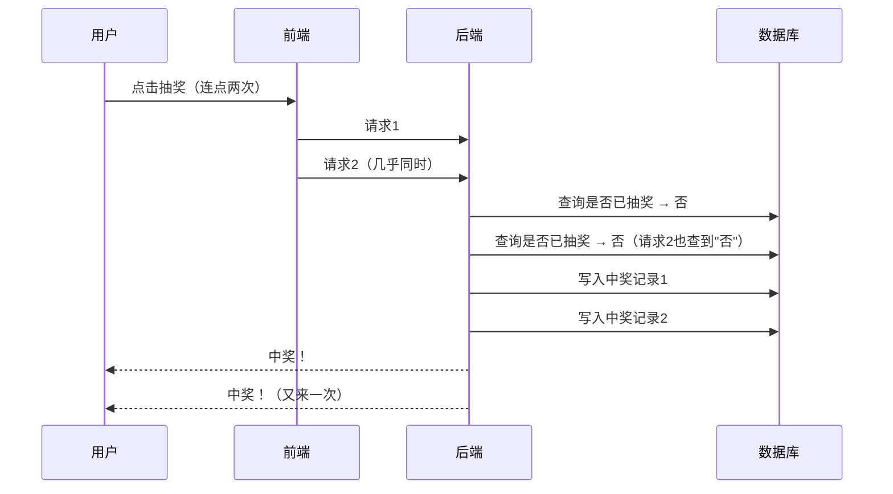

# 抽奖接口被连点两次，奖发了两份——幂等不是前端的事

用户连点了两次，两个请求时间差 200 毫秒先后到达后端，两次都成功，奖品发了两份。

这不算罕见。网络抖动重试、页面刷新、用两个标签页同时操作——这些场景前端拦不住，最终都会变成两条独立的请求打到你的接口。

防重不是前端的问题，是后端必须解决的问题。

## 前端禁用按钮为什么不够

前端加个按钮 loading，点完禁用——这没错，但只能拦住"同一个会话内的连点"。网络抖动、页面刷新、用户用两个 tab 同时操作，这些情况前端拦不住。

真正的问题在后端：两次请求都到了，后端都处理了，都发了奖。

防重这件事，前端做了是锦上添花，后端不做就是埋雷。

## 两次请求同时到达，会发生什么



两个请求都在写入前查了"是否已抽奖"，查到的都是"否"，于是都写入了。这是经典的**检查-执行**非原子问题。

## 正确的处理方式

核心思路：让同一个用户的同一次抽奖操作，不管请求到几次，结果只有一个。

做法不复杂，两步：

**第一步，生成唯一标识。** 用户点击抽奖时，前端带上一个 `requestId`（UUID 或时间戳+用户ID的组合），标识"这一次点击"。

**第二步，后端用 Redis 去重。** 收到请求后，先做原子占位：

```java
// SET requestId 1 NX EX 60
// NX = 不存在才写入，EX = 60秒后自动过期
Boolean acquired = redis.setIfAbsent("lottery:req:" + requestId, "1", 60, TimeUnit.SECONDS);
if (!acquired) {
    return "请勿重复提交";
}
// 通过，继续走抽奖逻辑
```

Redis 的 `NX` 保证了并发下只有一个请求能进去，天然是原子操作，不用额外加锁。

**第三步，数据库兜底。** 中奖记录表加唯一约束：

```sql
UNIQUE KEY uk_user_activity (user_id, activity_id)
```

即便两个请求赛跑进来，数据库层只会成功写入一条，另一条报唯一键冲突，捕获异常返回即可。

| 步骤 | 成功 | 失败/冲突 |
|------|------|----------|
| Redis NX 占位 | 继续执行抽奖逻辑 | 直接返回「请勿重复提交」 |
| DB 写入中奖记录（唯一键） | 返回中奖结果 | 捕获冲突异常，返回已处理 |

两道防线，一个在执行前（Redis 去重），一个在落库时（DB 唯一键）。单靠其中一个都有缝隙。

## 写这类接口前，先问自己一句

> 只要涉及"用户触发 → 后端发东西/扣东西"的操作，就要问自己一句：这个接口重复调两次，会出问题吗？

抽奖是，下单是，支付是，领券是，核销也是。
