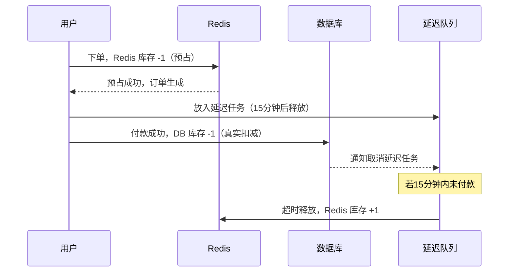

# 接到秒杀需求，你先别急着写代码

秒杀场景有一个核心矛盾：用户点击抢购的瞬间，并发请求可能几百上千个同时到达，但库存就那么几件。

在写任何一行代码之前，得先想清楚一件事：**库存扣减，放在哪一步？**

这个问题没有"显然正确"的答案，下单时扣和付款时扣都有问题。

## 两种方案，都有问题

**方案 A：下单时扣库存。**

用户点"立即购买"，库存 -1，订单生成，再去付款。

听起来顺，但有个场景：用户下了单不付款，库存一直被占着。100 件商品，100 个人下单全不付款，真正想买的人进来看到"已售罄"。

结果是：商品没卖出去，库存却没了。

**方案 B：付款时扣库存。**

用户先下单，付款成功后再扣库存。

这个问题更严重：1000 个人同时下单，库存还有 100，订单全部生成了。最后付款成功的有 300 人，超卖了 200 件。

| | 方案A：下单时扣库存 | 方案B：付款时扣库存 |
|---|---|---|
| 问题 | 不付款也占库存，真实用户买不到 | 订单超量生成，付款后超卖 |
| 适用 | 低并发、商品充足 | 不推荐 |

## 实际项目怎么做

没有完美方案，只有合适的取舍。主流做法是分三层：

**第一层：下单时用 Redis 预占库存。**

不是真扣，是"锁住"。Redis 原子操作先减，成功才允许下单。这一步必须用 Redis 而不是数据库——并发量一上来，数据库行锁撑不住。

```java
// 原子操作，库存不够直接返回失败
Long remaining = redis.decrement("stock:activity:100");
if (remaining < 0) {
    redis.increment("stock:activity:100"); // 回补
    return "库存不足";
}
// 预占成功，生成订单
```

**第二层：超时释放预占库存。**

下单后 15 分钟没付款，预占的库存自动释放，别人可以买。用延迟队列或 Redis 过期监听实现。

**第三层：付款成功后写数据库真实库存。**

付款成功后，同步扣减 DB 里的实际库存，做最终确认。



## 这道题没有完美解

> 秒杀库存的核心矛盾是：扣早了怕占而不买，扣晚了怕超卖。预占 + 超时释放是折中，不是完美解，但是够用的解。

Redis 预占解决并发超卖，超时释放解决恶意占库存，DB 最终确认保证数据准确。三步缺一不可。
