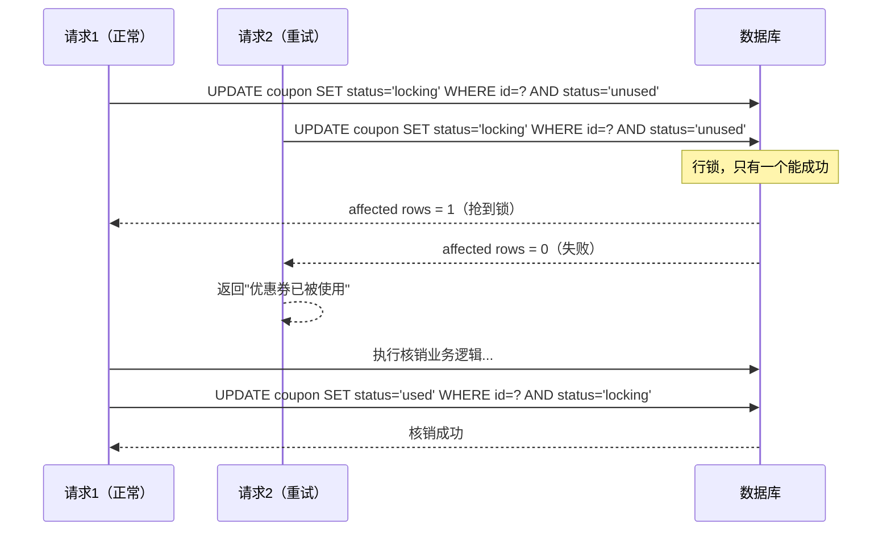

# 同一张券被核销了两次，你才意识到状态机有多重要

## 一张券被核销了两次

移动端弱网环境下，核销接口在 100ms 内被调用了两次（客户端自动重试），两次都返回成功，券被消耗了两张的价值，但库里只扣了一次用量。

接口没有 bug，问题出在缺少两样东西：**状态机** 和 **并发保护**。

---

## 优惠券有状态，状态流转不能随便跳

很多人把优惠券做成一个 `is_used` 字段，用了就置 1。这是最常见的错误。

优惠券本质上是一个**状态机**：

```
UNUSED（未使用）→ LOCKING（核销中）→ USED（已使用）
                                   ↘ UNUSED（核销失败回滚）
```

为什么要有 `LOCKING` 状态？

因为核销不是一步完成的，中间可能要扣优惠金额、写订单记录、发通知——这段时间里，券必须被"锁住"，不能被第二个请求再次核销。

---

## CAS 更新：只有一个请求能赢

最关键的一步是用 **CAS（Compare And Set）** 做状态变更：

```sql
-- 只有状态是 unused 的时候才能更新成功
-- 返回 affected rows = 0 → 说明已经被别的请求抢走了
UPDATE coupon
SET status = 'locking', lock_time = NOW(), order_id = ?
WHERE id = ?
  AND status = 'unused'
```

两个请求并发进来，数据库行锁保证只有一个 UPDATE 能影响到行，另一个 `affected rows = 0`，直接返回"券不可用"。

代码逻辑长这样：

```java
int rows = couponDao.lockCoupon(couponId, orderId);
if (rows == 0) {
    throw new BizException("优惠券已被使用或不可用");
}
// 继续后续核销逻辑...
doVerify(couponId, orderId);
// 核销完成，状态推进到 used
couponDao.markUsed(couponId, orderId);
```

核销失败时记得把状态回滚到 `unused`，否则券就永远卡在 `locking` 了。

---

## 接口幂等：重复调用要返回相同结果

光有 CAS 还不够。客户端弱网重试会发多次请求，我们要保证**同一次核销操作，不管调几次，结果一样**。

做法是引入 `requestId`（业务侧生成，每次核销唯一）：

```sql
-- 核销记录表，requestId 唯一索引
CREATE TABLE coupon_verify_log (
    request_id   VARCHAR(64) PRIMARY KEY,
    coupon_id    BIGINT,
    order_id     BIGINT,
    result       VARCHAR(16),  -- success / fail
    created_at   DATETIME
);
```

接口进来先查这张表，`requestId` 已存在就直接返回上次结果，不再重复执行核销逻辑。

---

## 并发核销时序图



---

## 两把锁，哪个都不能少

并发安全靠 CAS（`WHERE status='unused'`），重试安全靠幂等 requestId。两道防线各司其职，不能互相替代——光有 CAS 拦不住重试，光有幂等拦不住并发。
