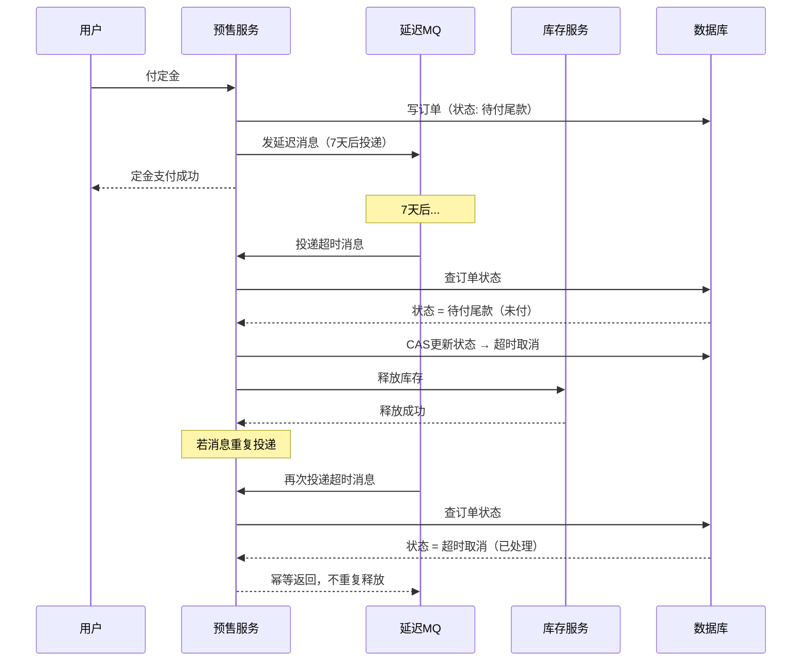

# 预售尾款超时没释放库存——定时任务扫表是个坑

## 扫表定时任务，数据一多就撑不住

预售场景：用户付了定金，7天内补尾款，否则自动释放库存。

第一反应往往是写个定时任务，每小时扫一遍 `presale_order` 表，超时的就释放。数据量小的时候这样没问题，预售活动一来，订单表百万行，扫表越来越慢，定时任务卡住了，释放延迟几小时，库存一直被占，其他用户买不到。

扫表方案有三个致命问题：
1. **量大扫慢**：全表扫，MySQL 索引加了也架不住几百万行
2. **释放不及时**：1小时扫一次，最坏情况延迟59分钟
3. **容易漏掉**：定时任务挂了、跳了，那批订单就永远不释放

---

## 让 MQ 替你计时，比定时任务可靠多了

下定金的时候，同时发一条**延迟消息**（RocketMQ 延迟消息或 Delay Queue）：

```java
// 下定金时，发一条7天后到期的延迟消息
void payDeposit(Long orderId, Long userId) {
    // 1. 写订单状态：定金已付
    presaleOrderDao.updateStatus(orderId, DEPOSIT_PAID);
    presaleOrderDao.setExpireTime(orderId, now().plusDays(7));
    
    // 2. 发延迟消息，7天后消费
    Message msg = new Message("presale-timeout-topic", 
                              buildPayload(orderId));
    msg.setDelayTimeLevel(7 * 24 * 60 * 60);  // 7天，秒为单位
    producer.send(msg);
}
```

7天后，消息队列自动把消息投递给消费者，消费者检查订单状态，如果还是"待付尾款"就释放库存。

---

## 消费端：状态机 + 幂等

消费端有两个关键点：

**1. 检查状态，严格按状态机走**

```
定金已付 → 尾款待付 → 尾款已付（完成）
                    ↘ 超时未付（释放库存）
```

```java
void handleTimeout(Long orderId) {
    PresaleOrder order = presaleOrderDao.findById(orderId);
    
    // 状态不是"待付尾款"就直接返回（用户可能已经付了）
    if (order.getStatus() != WAITING_FINAL_PAYMENT) {
        log.info("订单{}状态非待付尾款，跳过释放", orderId);
        return;
    }
    
    // CAS 更新，防止并发
    int rows = presaleOrderDao.updateStatus(
        orderId, WAITING_FINAL_PAYMENT, TIMEOUT_CANCELLED);
    if (rows > 0) {
        inventoryService.release(order.getSkuId(), order.getQuantity());
    }
}
```

**2. 消费幂等**

延迟消息可能因为网络抖动被重复投递，消费端必须幂等。上面的 CAS 更新（`WHERE status = 'waiting_final_payment'`）天然保证了幂等——状态改过一次之后，第二次来就走 `rows = 0` 的分支，不会重复释放。

---

## 完整链路时序图



---

## 兜底：定时任务作为补偿

延迟消息也可能丢（MQ 极端情况下宕机重启丢消息）。所以定时任务不是完全去掉，而是**降级成兜底补偿**：

- 延迟消息：主路径，精准触发，即时释放
- 定时任务：兜底，每天扫一遍"超时超过1小时但还未释放"的订单

主路径的延迟 < 1分钟，定时任务的补偿兜底延迟 < 1小时，两者互补，没有漏网之鱼。

---

## 定时任务只配当兜底

延迟消息是主角，定时任务是保险。消息来了就处理，没来的那批靠定时任务补扫——顺序不能搞反，两个角色都不能省。
