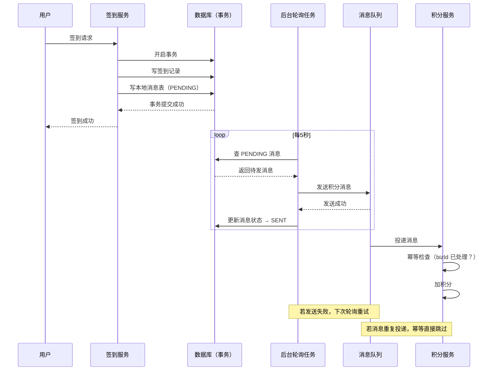

# 签到写进去了，积分却没到账：DB 和 MQ 不在同一个事务

## 签到记录有，积分没有

日志里能看到签到记录，页面也返回了"签到成功"，但积分表里什么都没有。

问题出在 MQ 那一步：签到写 DB 成功，MQ 消息发失败，异常被吞掉了，流程就这么过去了。

根本原因是 **DB 操作和 MQ 发送天然不在同一个事务里**——一个成功、一个失败，系统不知道，数据就裂开了。

---

## 常见错误：MQ 和 DB 的顺序写反了

很多人第一版代码是这样的（**错误示范**）：

```java
// ❌ 错误：先发 MQ，再写 DB
void signIn(Long userId) {
    // 1. 发消息通知积分服务
    mqProducer.send("points-topic", buildMsg(userId, 10));  // 假如这里成功了
    
    // 2. 写签到记录
    signInDao.insert(userId, LocalDate.now());  // 假如这里失败了
    
    // 结果：积分发了，但没有签到记录——用户白得积分，或者积分发了但签到没记录
}
```

还有人把顺序反过来（**还是错误**）：

```java
// ❌ 也是错误：先写 DB，再发 MQ
void signIn(Long userId) {
    signInDao.insert(userId, LocalDate.now());  // 写成功
    mqProducer.send("points-topic", buildMsg(userId, 10));  // 发失败 → 积分丢了
}
```

两种都不安全，因为 **DB 操作和 MQ 发送天然不在同一个事务里**，中间任何一步失败，就会出现数据不一致。

---

## 本地消息表：把两步写入变成原子操作

解法核心：**把 MQ 发送和 DB 写入放进同一个数据库事务**。

做法是引入一张本地消息表，在事务内同时写签到记录和消息记录，后台轮询消息表，负责实际发送 MQ：

```sql
-- 本地消息表
CREATE TABLE local_message (
    id          BIGINT PRIMARY KEY AUTO_INCREMENT,
    biz_type    VARCHAR(32),   -- 业务类型，如 SIGNIN_POINTS
    biz_id      VARCHAR(64),   -- 幂等 key，如 userId_date
    payload     TEXT,          -- 消息内容
    status      VARCHAR(16),   -- PENDING / SENT / FAILED
    retry_count INT DEFAULT 0,
    created_at  DATETIME
);
```

签到服务里：

```java
@Transactional
void signIn(Long userId) {
    // 事务内，两个写操作是原子的
    // 1. 写签到记录
    signInDao.insert(userId, LocalDate.now());
    
    // 2. 写本地消息表（不是发 MQ！）
    localMessageDao.insert(LocalMessage.builder()
        .bizType("SIGNIN_POINTS")
        .bizId(userId + "_" + LocalDate.now())  // 幂等 key
        .payload(buildPayload(userId, 10))
        .status("PENDING")
        .build());
    
    // 事务提交，两个操作同时生效或同时回滚
}
```

后台有个轮询任务，扫 `status=PENDING` 的消息，发送 MQ，成功后更新为 `SENT`，失败重试：

```java
// 后台任务，每5秒执行一次
void pollAndSend() {
    List<LocalMessage> msgs = localMessageDao.findPending(limit=100);
    for (LocalMessage msg : msgs) {
        try {
            mqProducer.send("points-topic", msg.getPayload());
            localMessageDao.updateStatus(msg.getId(), "SENT");
        } catch (Exception e) {
            localMessageDao.incrRetry(msg.getId());  // 失败计次
        }
    }
}
```

---

## 消费端幂等：同一条消息不能重复加积分

网络抖动时，MQ 消息可能被重复投递。积分服务消费端必须做幂等：

```java
void consumePointsMsg(PointsMessage msg) {
    // 用 bizId 做幂等检查（唯一索引防重复插入）
    boolean inserted = pointsLogDao.insertIgnore(
        msg.getUserId(), msg.getPoints(), msg.getBizId());
    
    if (!inserted) {
        log.info("重复消息，跳过: {}", msg.getBizId());
        return;
    }
    
    // 加积分
    pointsDao.addPoints(msg.getUserId(), msg.getPoints());
}
```

`insertIgnore` + 唯一索引保证同一个 `bizId` 只会成功插入一次，重复消息直接丢弃。

---

## 正确的签到→积分链路



---

## 可靠投递的标准解法

DB 和 MQ 从来不在同一个事务里，谁先谁后都有丢失的风险。本地消息表的思路是把"发消息"这件事变成一次数据库写入，借助事务的原子性保证消息不丢，再靠轮询重发和消费端幂等保证最终送达。
