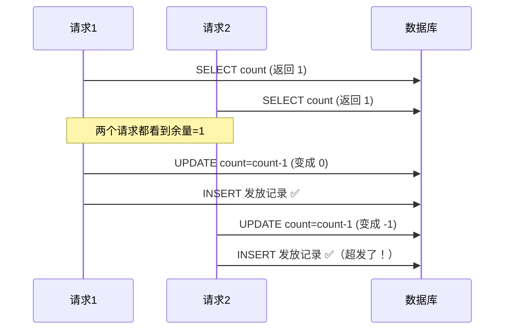
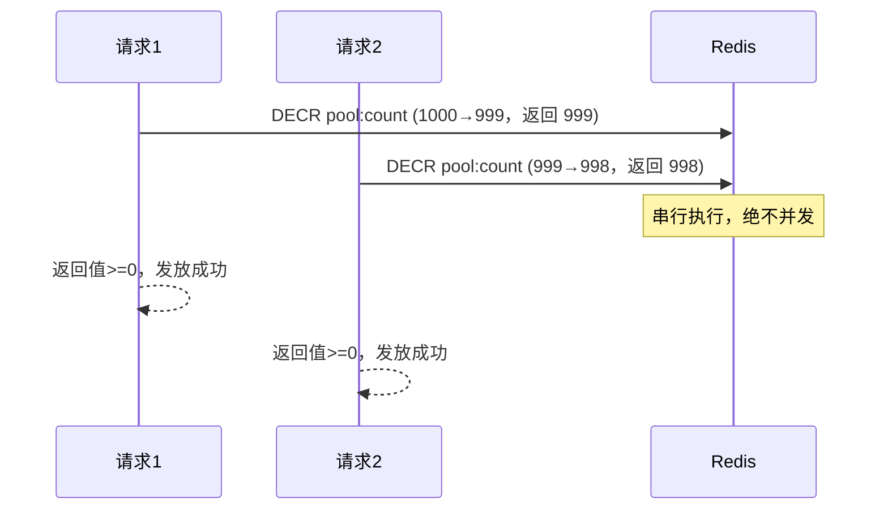

# 双11红包雨多发了 2000 个——并发读库存，是经典的定时炸弹

预算 10000 个红包，活动跑了一小时，数据库写了 12073 条发放记录。

代码逻辑看起来没问题：

## 为什么"看起来没问题"的代码会超发

```java
// 看起来没问题，实际上是定时炸弹
public boolean sendRedPacket(String userId) {
    int remaining = db.query("SELECT count FROM red_packet_pool WHERE id = 1");
    if (remaining > 0) {
        db.update("UPDATE red_packet_pool SET count = count - 1 WHERE id = 1");
        db.insert("红包发放记录", userId);
        return true;
    }
    return false;
}
```

---

## 并发下这段逻辑会炸

1000 个请求同时打进来，每个都先查了余量，查到的都是 "500"，于是每个都认为"有余量，可以发"，然后都去写入。

数据库的 `count - 1` 即便是原子的，也架不住 1000 个请求同时触发 1000 次写——到最后你会发现 `count` 变成了 -997，但发放记录写了 1000 条。



这就是经典的**读后写竞态条件（Read-Modify-Write race condition）**。

---

## Redis DECR 才是正解

Redis 的 `DECR` 是单线程执行的，天然原子，不存在并发读到同一个值的问题。

```python
def send_red_packet(user_id: str) -> bool:
    # DECR 原子扣减，返回扣减后的值
    remaining = redis.decr("red_packet:pool:count")

    if remaining < 0:
        # 已经超发，把这次扣减补回去
        redis.incr("red_packet:pool:count")
        return False  # 告诉用户没抢到

    # 扣减成功，异步写 DB 发放记录
    mq.send("red_packet.granted", {"user_id": user_id})
    return True
```

关键点：**先扣减，看返回值**。返回值 < 0 说明这次扣减越界了，回补一个，然后拒绝。不需要先查再写。



并发下，Redis 内部把所有 DECR 排成队列一个个执行，每个请求拿到的返回值都是唯一的，不会出现两个请求同时看到 "1" 的情况。

---

## 两个容易忽略的细节

**1. 活动前预热，不要活动开始时初始化**

活动开始那一刻流量最大，如果这时候才往 Redis 写初始库存，有可能初始化本身就挤在高峰里出问题。活动开始前 5 分钟就把库存预热写进 Redis，别等活动开始那一刻再初始化。

```bash
# 活动开始前执行
redis-cli SET red_packet:pool:count 10000
```

**2. Redis 和 DB 最终要一致**

Redis 是内存，重启会丢。发放记录的真相在 DB。可以用异步消息队列（如上面代码里的 `mq.send`），也可以定期从 DB 对账把真实发放数同步回 Redis——关键是不要依赖 Redis 作为最终数据源。

---

**并发扣减的铁律**：永远别用"先查再写"——用 Redis DECR，拿返回值说话，返回负数就是超发，立刻回补拒绝。
