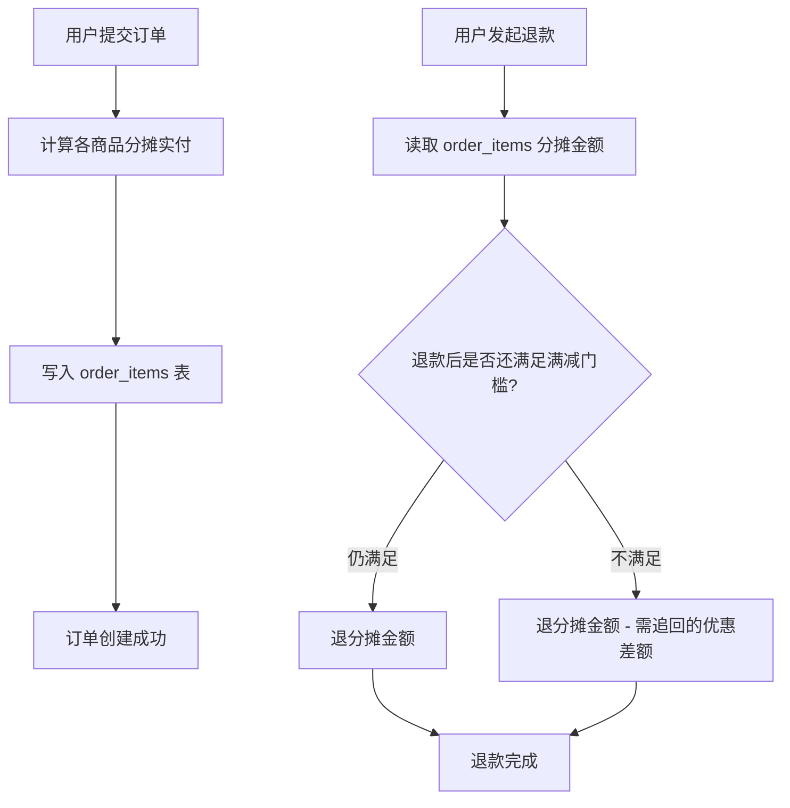

# 退货按原价退，用户净赚了 50 块——优惠分摊是个容易忽略的计算题

用户买了 A（100元）、B（120元）、C（80元），合计 300 元，满300减50，实付 250 元。退了 A，退款打了 120 元过去。

账对不上：用户拿回退款 120，手里还有 B+C 价值 200，合计 300，但他只付了 250。

**退款用的是商品原价，没有做优惠分摊。** 这是退款接口最常见的漏洞之一。

## 为什么退款不能用原价

优惠券是针对整单的，不是针对某件商品的。退部分商品时，这张券省下的 50 元必须按比例分摊到每件商品上，不能让某件商品独吞或全还。

---

## 分摊公式

每件商品的实际支付金额，按它在原价中的占比来算：

```
商品实付 = 商品原价 / 订单原总价 × 订单实付总额
```

套入刚才的例子：

| 商品 | 原价 | 分摊比例 | 实付 |
|------|------|----------|------|
| A    | 100  | 100/300 = 33.3% | 83.3 元 |
| B    | 120  | 120/300 = 40%   | 100 元  |
| C    | 80   | 80/300 = 26.7%  | 66.7 元 |
| 合计 | 300  | —                | 250 元  |

退A，应退 **83.3 元**，不是 100 元。

**精度处理**：浮点运算会有 0.01 元的误差，通常的做法是最后一件商品用 `实付总额 - 其他商品分摊之和` 兜底，避免总额对不上。

---

## 下单时就要算好，存起来

退款时再算有一个大坑：**商品价格可能已经变了**。

活动结束了，促销价消失了，300元变成了350元。这时候用"当前价格"算分摊，结果就错了。

解法是：**分摊金额在下单时就计算好，存进订单明细表，退款时直接读存量。**



---

## 退款后不满足门槛，还得追回优惠差额

这里还有一层：用户退了A之后，剩余订单金额是 200 元，不再满足满300减50的条件了。

**那50元优惠怎么处理？**

有两种策略，产品决定选哪个：

**策略一：追回优惠差额**
退款金额 = 83.3 元（A的分摊）- 50 元（追回优惠）= **33.3 元退款**

**策略二：不追回，但记录风险**
直接退 83.3 元，但标记这笔订单"优惠已溢出"，后续风控可以关注。（适合客单价高、客诉成本高的场景）

```python
def calculate_refund(order_id: str, item_id: str) -> float:
    order = db.get_order(order_id)
    item = db.get_order_item(item_id)  # 已存储的分摊金额

    refund_amount = item.actual_paid  # 从下单时存的分摊金额读

    # 检查退款后剩余订单是否仍满足满减门槛
    remaining_paid = order.actual_paid - item.actual_paid
    remaining_original = order.original_amount - item.original_price

    if remaining_original < order.discount_threshold:
        # 不再满足门槛，需追回优惠
        refund_amount -= order.discount_amount
        if refund_amount < 0:
            refund_amount = 0  # 最低退0，不能让用户倒贴

    return refund_amount
```

---

**一个原则**：退款金额 = 按比例分摊的实付金额，分摊结果要在下单时就存进去——退款时读存量，别碰原价，也别重新算。
