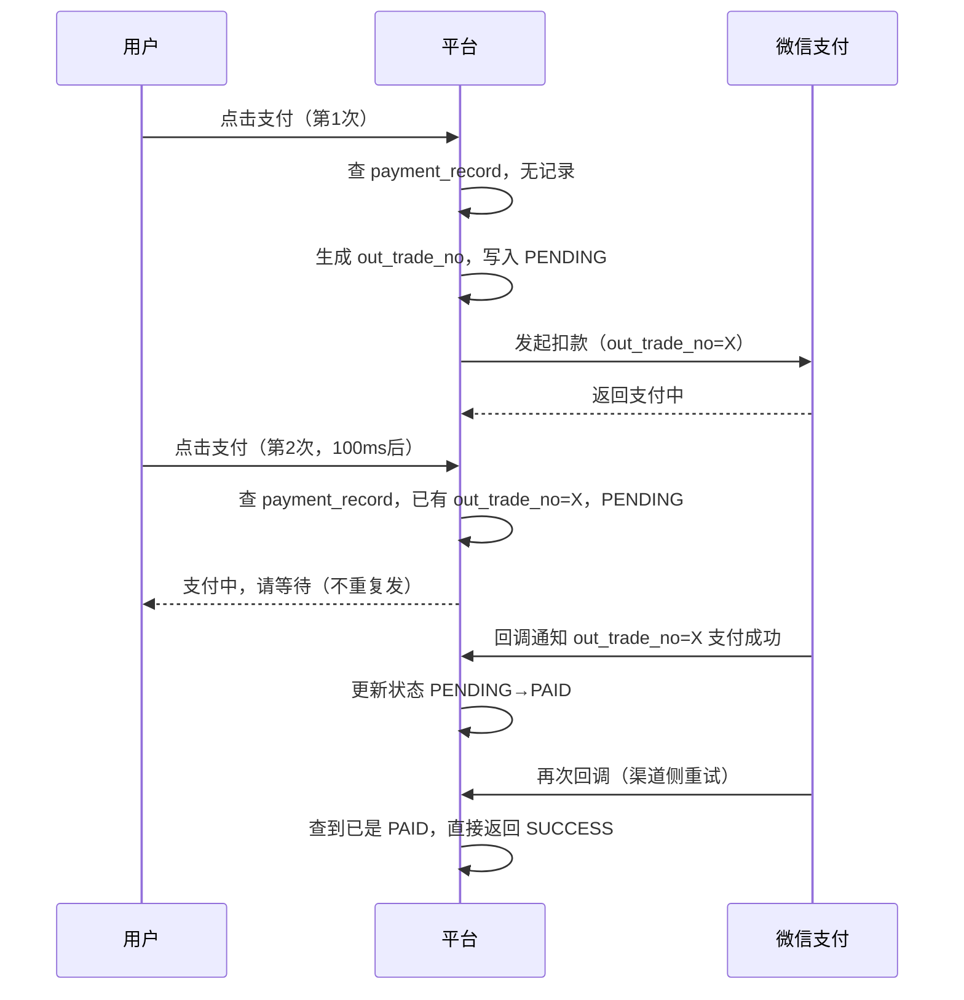

# 用户点了两次付款，扣了两次——支付幂等比你想的复杂

支付幂等和抽奖幂等听起来是同一个问题，但支付场景有三方：用户、平台、支付渠道（微信支付/支付宝）。

用户侧重复点击，只是问题之一。更难处理的是：平台调了支付渠道扣款，结果不确定（成功/失败/超时）——这时候要不要重试？重试如果发出去了两次请求，渠道侧扣了两次怎么办？

---

## 同一笔订单，只能发一次扣款请求

关键在于**业务订单号**（`out_trade_no`）全局唯一，且每笔订单只允许发起一次扣款。

```java
// 调微信支付前，先查这笔订单是否已经发起过支付
PaymentRecord existing = paymentDao.findByOrderId(orderId);
if (existing != null) {
    return existing.getStatus();  // 直接返回已有状态，不重复发
}

// 生成唯一支付单号（平台侧）
String outTradeNo = generateTradeNo(orderId);
paymentDao.insert(orderId, outTradeNo, PENDING);

// 调微信支付
WxPayResult result = wxPay.unifiedOrder(outTradeNo, amount, ...);
```

`out_trade_no` 是平台传给支付渠道的唯一标识。微信/支付宝会拒绝同一个 `out_trade_no` 的重复扣款请求，这是渠道侧的幂等保护。

所以：平台侧的幂等 → 用数据库唯一索引保证同一 `orderId` 只生成一个 `out_trade_no`；渠道侧的幂等 → 复用同一个 `out_trade_no` 重试，渠道不会重复扣。

---

## 渠道回调去重

支付成功后，微信/支付宝会主动回调平台的回调接口，通知扣款结果。但回调可能发多次（网络问题、渠道侧重试机制），平台必须对回调做去重。

```java
@PostMapping("/payment/notify")
public String handleNotify(WxPayNotify notify) {
    String outTradeNo = notify.getOutTradeNo();

    // 幂等：已经处理过的回调，直接返回 success
    PaymentRecord record = paymentDao.findByTradeNo(outTradeNo);
    if (record.getStatus() == PAID) {
        return "SUCCESS";
    }

    // 验签（必须做，防伪造回调）
    if (!wxPay.verifySign(notify)) {
        return "FAIL";
    }

    // 更新订单状态（用 CAS，防并发）
    int rows = paymentDao.updateToPaid(outTradeNo, PENDING);
    if (rows == 0) {
        return "SUCCESS";  // 已被其他请求处理
    }

    // 触发后续逻辑（发货/发券等）
    orderService.onPaySuccess(outTradeNo);
    return "SUCCESS";
}
```

验签必须在去重之前做，否则伪造的回调可以利用已有记录绕过验签。

---

## 主动查询：别只等回调

回调有延迟，甚至可能丢失。依赖回调实现支付状态更新是不够的，还需要**主动轮询**兜底。

```java
// 定时任务：扫 PENDING 状态超过 5 分钟的支付单
List<PaymentRecord> pendingList = paymentDao.findPendingTimeout(5);
for (PaymentRecord record : pendingList) {
    WxPayQueryResult result = wxPay.queryOrder(record.getOutTradeNo());
    if (result.isPaid()) {
        // 补触发成功逻辑
        paymentDao.updateToPaid(record.getOutTradeNo(), PENDING);
        orderService.onPaySuccess(record.getOutTradeNo());
    } else if (result.isClosed()) {
        paymentDao.updateToClosed(record.getOutTradeNo());
    }
}
```

主动查询 + 被动回调结合，才能保证最终一致性。

---

## 时序图：重复点击的处理流程



---

## 平台侧、渠道侧、回调侧，三层各管一段

平台侧：`out_trade_no` 全局唯一，同一笔订单只允许生成一个，挡住重复发起。渠道侧：同一个 `out_trade_no` 重试，渠道幂等不重复扣。回调侧：CAS 推进状态，主动轮询兜底丢失的回调。三层之间没有强依赖，缺任何一层都会有漏洞。
