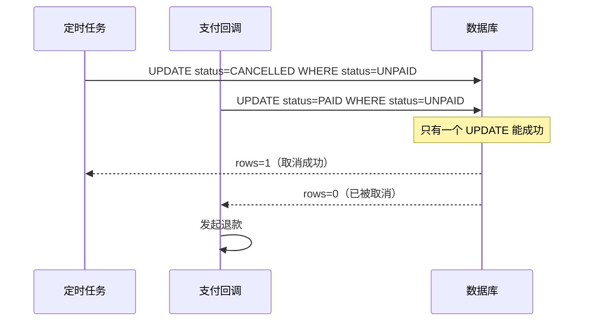

# 定时任务取消订单，和用户付款撞了——你以为不会发生

订单超时未支付，定时任务把它取消了。但几乎同一时刻，用户点了"立即支付"，付款成功了。

结果：钱扣了，订单是"已取消"状态，商家没有收到履约通知。

这个场景不是极端 case，只要有定时任务 + 支付两个并发路径，就会撞上。

---

## 两条路径的竞态

定时任务执行流程：
```
查到订单状态=UNPAID, 超时 → UPDATE status=CANCELLED → 释放库存
```

用户支付执行流程：
```
查到订单状态=UNPAID → 调支付渠道扣款 → 收到回调 → UPDATE status=PAID → 触发履约
```

两条路径都以"当前状态是 UNPAID"为前提，但它们之间没有协调机制。

---

## 用状态机 + CAS 解决

核心思路：状态更新用 CAS，`WHERE status = 旧状态`，确保只有一方能成功推进状态。

定时任务侧：

```java
// 只更新状态为 UNPAID 的，其他状态不动
int rows = orderDao.updateStatus(orderId, CANCELLED, UNPAID);
if (rows == 0) {
    // 已被更新为其他状态（比如 PAID），不继续取消
    return;
}
// 取消成功，释放库存
inventoryService.release(orderId);
```

支付回调侧：

```java
@Transactional
public void onPaySuccess(String outTradeNo) {
    Order order = orderDao.findByTradeNo(outTradeNo);
    // 只有 UNPAID 的订单才能推进到 PAID
    int rows = orderDao.updateStatus(order.getId(), PAID, UNPAID);
    if (rows == 0) {
        // 订单已被取消，需要退款
        alipay.refund(outTradeNo, order.getAmount());
        return;
    }
    // 状态更新成功，触发履约
    fulfillmentService.triggerFulfillment(order);
}
```

这两段代码都用 `WHERE status = UNPAID` 作为 CAS 条件，并发执行时只有一个能拿到 `affected rows = 1`，另一个感知到状态已变，走各自的异常分支。

---

## 取消在先，付款在后

定时任务先取消了（`status = CANCELLED`），支付回调后到：

- 支付回调的 `WHERE status = UNPAID` 匹配不到行 → `rows = 0`
- 发现订单已取消 → 主动发起退款
- 用户钱退回来，体验虽差但数据没错

---

## 付款在先，取消在后

支付回调先到（`status = PAID`），定时任务后执行：

- 定时任务的 `WHERE status = UNPAID` 匹配不到行 → `rows = 0`
- 识别到订单已支付 → 跳过取消，不释放库存
- 订单正常履约

---

## 时序图



---

## CAS 是兜底，时间窗口是第一道防线

定时任务触发的时机很重要。如果订单超时是"30分钟未支付"，定时任务不应该在第 30 分 01 秒就立刻取消——用户可能刚在支付页面点了"确认"，支付渠道还在处理中。

实践上通常多留几分钟缓冲，比如 35 分钟后才触发取消。时间窗口减少竞态概率，CAS 处理真正撞上的情况，两者结合才稳。
