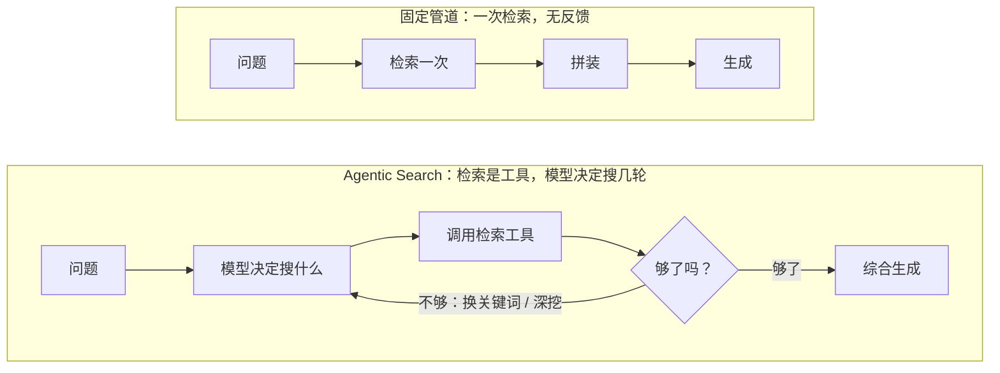

# Agentic Search：让模型自己去搜，检索范式的迁移

前两篇讲的 RAG，有一个隐含的假设：**检索是一条固定的管道**——问题进来，切片、算向量、取前几个、拼进上下文、生成回答。管道由代码写死，模型只在最后一步出场。

这两年出现了另一种形态：**把检索变成模型的工具**。模型拿到问题后自己决定搜什么、搜几轮、要不要换关键词、什么时候够了。这叫 Agentic Search（也叫 Agentic RAG）。这篇讲两种范式的差别、各自的代价、什么场景该用哪个。

---

## 老范式：固定管道

**问题 → 检索（一次）→ 拼装 → 生成**

特点是**一次性、无反馈**：检索只做一次，检索得好不好模型不知道也管不了。问题措辞不好、检索结果不相关、需要多个信息源综合——管道没有任何机制处理这些情况，只能靠上游把检索调得尽量准。

它的优点同样来自"固定"：延迟可预测（一次检索 + 一次生成）、成本可预测、行为可复现、容易调试。

---

## 新范式：检索是工具，模型是调度者

给模型几个检索工具——搜知识库、搜网页、读某份文档、grep 代码——然后把问题交给它。模型的行为变成一个循环：

1. 分析问题，决定先搜什么
2. 调用检索工具，看结果
3. 判断够不够：够了就回答；不够就换关键词再搜，或者顺着结果里的线索搜下一层
4. 重复直到满意，综合所有材料生成回答

关键变化是**有了反馈闭环**：模型看到检索结果后能判断"这不是我要的"然后调整。一个问题可能触发三五次检索，每次都基于上一次的结果。

这个循环就是第五章要讲的 Agent Loop，检索只是它的一个应用。厂商的 Deep Research 类产品（第 08 篇）是它的极端形态：几十上百次搜索。

---

## 一个有代表性的转向

编程 Agent 是 Agentic Search 落地最深的地方，而且发生了一件值得注意的事：**有代表性的编程 Agent 去掉了向量检索**，不再给代码库建 embedding 索引，改成给模型 grep 和读文件的工具，让它自己找。

理由很实际：代码有精确的标识符，模型知道该搜什么名字；grep 结果精确、没有"看起来相似"的噪声；不需要维护索引，代码改了立刻生效；模型可以顺着 import 一层层读下去，这是向量检索做不到的"沿着结构走"。

第三方评测里，让模型用文件系统工具自己找，在多数代码库问答任务上比传统向量 RAG 准确率更高。这不是说向量检索没用了（第 18 篇讲了它的主场），是说**当语料有结构、模型知道怎么在里面导航时，让它自己走比预先切片再匹配更好**。

---

## 代价：延迟、成本、不可预测

新范式的每一个优点都有对应的账单：

**延迟叠加**。三次检索 + 三次模型推理（每次推理决定下一步搜什么）+ 一次最终生成，串行加起来可能是老范式的五到十倍。对话场景里用户要等得住。

**成本放大**。每一轮循环都是一次完整的模型调用，带着全部工具定义和之前所有检索结果。第 10 篇说过：Agent 步数是成本放大器。一个简单问题模型可能也要搜两三轮，账单是固定管道的几倍。

**不可预测**。同一个问题，两次运行可能走不同的搜索路径、得到不同的答案。延迟和成本都有方差。调试也难：出错时要回放整条搜索链才知道哪一步跑偏了。

**跑偏风险**。模型可能在错误的方向上越搜越深，或者搜够了还不停。需要最大步数、超时这类硬限制，第 23 篇讲。

---

## 什么场景用哪个

**固定管道适合**：

- 高频、低延迟要求的问答（客服、搜索框联想）
- 问题类型稳定、一次检索通常就能命中
- 成本敏感、需要可预测的账单
- 需要严格可复现（合规、审计场景）

**Agentic Search 适合**：

- 复杂问题，需要多个信息源综合、多跳推理（"A 政策对 B 部门去年的项目有什么影响"）
- 语料有结构可以导航（代码库、有链接关系的文档、有层级的知识体系）
- 一次检索经常不够，需要根据结果调整的场景
- 用户能接受几十秒到几分钟的等待（研究、分析、报告生成）

**混合**：先用固定管道试一次，检索结果的相关性够高就直接生成；不够高再升级到 Agentic 循环。这样多数简单问题走快路径，复杂问题才付出循环的代价。这是目前性价比最好的做法。

---

## 对检索基础设施的影响

范式迁移不是要拆掉检索层，而是**改变它的接口**：

- 老范式里检索层的输出是"拼好的上下文"，新范式里是"一个模型可以反复调用的工具"。工具的描述、参数设计、返回格式（返回多少、带不带元数据）直接影响模型会不会正确使用它。
- 检索工具要**支持迭代**：分页、按元数据过滤、按结构导航（读某个文档的下一节、查某个函数的调用方）。一次性返回 top-K 的接口对 Agent 来说太粗。
- 混合检索、重排（第 18 篇）在新范式里依然有用——它们让每一次工具调用更准，减少循环轮数。

第 22 篇讲工具调用的数据流，第 24 篇讲 MCP 怎么把检索工具标准化。到那时再回头看，Agentic Search 就是"Agent 用检索工具"这么简单的事。

---

**🎯 AI 冷知识小测**

上一篇答案：**B**——向量管语义、关键词管精确，两者混合再加重排精排，是现在的标准配置。

有代表性的编程 Agent 在 2025 年去掉了代码库的向量检索，换成了什么？

A. 更大的 embedding 模型
B. grep 和读文件工具，让模型自己找
C. 把整个代码库塞进上下文

下方投票选一个，想说理由的评论区聊，下一篇揭晓。
