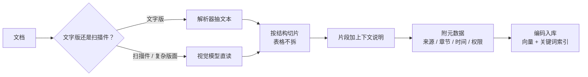

# 文档进知识库，处理链路要注意什么

前三篇讲的是"怎么找"。这篇讲前置的一步：**文档怎么进去**。

一份 PDF 从上传到能被检索到，中间有一条处理链路：解析、切片、加元数据、编码入库。RAG 效果差的案例里，一大半根因在这条链路上——检索算法再好，喂进去的片段是碎的、错的、缺信息的，出来的就是垃圾。这篇讲每一步现在该怎么做、哪些老经验已经变了。

---

## 第一步：解析——文档到文本，比想象中难

Word、Markdown 这类结构化文档好办。难的是 PDF、扫描件、带复杂表格和图表的报告。

老做法是 **OCR + 版面分析**：先用视觉模型识别版面（这块是标题、那块是表格、那块是图），再用 OCR 抽文字，再用专门的算法重建表格结构。链路长、每一步都可能出错，跨页表格、多栏排版、图文混排是经典翻车点。

现在多了一条路：**直接用视觉模型读**。把 PDF 每页渲染成图片，交给多模态模型，让它输出结构化的文本（Markdown 格式的标题、段落、表格）。模型能理解版面，跨页表格、图表里的数据都能读出来。第 01 篇讲的"原生多模态"在这里直接兑现。

两者怎么选：

- **文字版 PDF、版面简单**：传统解析器直接抽文本，快、便宜、准确，不需要视觉模型
- **扫描件、复杂版面、大量表格图表**：视觉模型读，效果明显好，代价是每页一次模型调用，慢且贵
- **量大且格式统一**：先用视觉模型处理一批样本，看传统解析器在哪些版式上出错，只对那些版式走视觉模型

还有一种更激进的做法：**不解析，直接检索页面图片**。用视觉 embedding 模型把每一页当图片编码，查询时也编码成同一空间的向量。省掉整条解析链路，图表、版面信息全部保留。适合图表密集、解析总出错的文档，目前的代价是索引更大、检索更慢。

---

## 第二步：切片——在 Agentic 时代还重不重要

切片（Chunking）是把长文档切成检索单元。三年前这是 RAG 调优的核心参数：切多大、重叠多少、按什么切。

**现在它的重要性下降了，但没消失。**

下降的原因：上下文变长了，切片可以切得更大（一节、一章而不是几句话），甚至检索到之后把整份文档塞进去（第 17 篇的混合形态），切片边界的影响被稀释了。Agentic Search 里模型可以顺着结构读下一段，切碎了也能自己拼回去。

没消失的原因：检索的基本单元还是片段，切得不好召回就差。而且有一条结论这两年被反复验证：**按文档结构切，效果稳定优于按固定长度切**。按标题层级、按段落、按表格边界切，每个片段是一个语义完整的单元；固定 500 字硬切，一个概念被切成两半是常态。

实用建议：

- **有结构就按结构切**：Markdown 按标题、PDF 按解析出的版面块、代码按函数/类
- **片段要够大**：几百到一两千 token，让每个片段自带足够的上下文。太小的片段（一两句话）检索出来模型也不知道它在说什么
- **表格不要切开**：一张表就是一个片段，切开后行和表头分离，数据就没意义了
- **重叠可以少用**：结构切片下重叠的价值不大；固定长度切片才需要重叠来补边界

---

## 第三步：给片段加上下文

第 18 篇提过的做法，这里展开：一个片段孤立地看，经常缺少定位信息。"第三条：违约方应支付合同总额 10% 的违约金"——哪份合同？谁和谁的？什么时候签的？片段里没有，检索时就匹配不上"XX 公司合同的违约条款"这种问题。

做法是入库前让模型给每个片段生成一句说明："本段出自《XX 采购合同》第五章违约责任，说明违约金比例"，把说明和原文拼在一起编码。成本是每个片段多一次模型调用（用小模型、走批量接口，第 12 篇），收益是检索准确率显著提升。这是目前性价比最高的 RAG 优化之一。

---

## 第四步：元数据设计

每个片段除了文本和向量，还要带**元数据**：来源文档、章节路径、页码、创建时间、更新时间、作者、部门、权限标签、文档类型。

元数据的用途：

- **权限过滤**：第 17 篇说的，权限在检索层做，靠的就是元数据里的权限标签。检索时先按用户权限过滤，再算相似度
- **范围限定**：用户问"去年的政策"，按时间过滤；问"财务的规定"，按部门过滤。混合检索里元数据过滤和向量检索一起用，是标配
- **引用溯源**：回答要标出处（第 08 篇的 Grounding），靠的是片段带的文档名和页码
- **更新管理**：文档改了，要找到它的所有片段删掉重建，靠来源文档 ID

元数据设计要在入库前想清楚，事后补比重建索引还麻烦。原则：**凡是将来可能用来过滤或展示的字段，入库时就带上**。

---

## 第五步：更新和删除

知识库不是一次性建好的。文档会改、会废、会新增。链路要支持：

- **按文档粒度重建**：某份文档更新了，删掉它的全部旧片段，重新走一遍解析、切片、编码。不要做片段级的增量更新，边界对不上
- **删除要彻底**：废弃的文档没删干净，模型会引用过期的规定。这类事故很常见，且用户很难发现
- **版本处理**：同一份文档的多个版本同时在库里，检索会把旧版本的片段和新版本的混在一起。要么只留最新版，要么元数据标版本、检索时过滤

---

## 一条完整的链路

把五步串起来，一份 PDF 进知识库的过程：

1. 判断类型：文字版走解析器，扫描件或复杂版面走视觉模型
2. 得到带结构的文本，按结构切成语义完整的片段，表格保持完整
3. 每个片段生成一句上下文说明，拼在原文前面
4. 附上元数据：来源、章节、页码、时间、权限
5. 编码入库（向量 + 关键词索引都建）
6. 记录文档 ID 和片段的对应关系，供更新删除用

这条链路的每一步都在决定检索的上限。做 RAG 效果差先查这里，再查检索算法，最后才是换模型。

---

**🎯 反直觉一问**

上一篇答案：**B**——换成了 grep 和读文件工具。代码有精确标识符，让模型自己搜、自己顺着结构读，比向量匹配更准，也不用维护索引。

把一份长文档切片入库，下面哪种切法效果通常最差？

A. 按标题和段落结构切，每片一个完整的语义单元
B. 每 500 字硬切一段，前后重叠 50 字
C. 表格整张作为一片，不拆开

下方投票选一个，想说理由的评论区聊，下一篇揭晓。第四章到此结束，下一篇进入 Agent。
