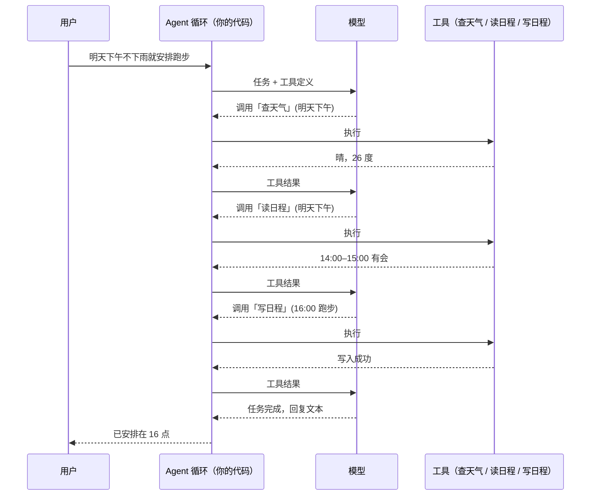

# Agent 到底是什么：从"聊天"到"干活"

前面二十篇，模型一直是"回答问题的"。从这一章开始，模型变成"干活的"。

Agent 这个词已经被用滥了：聊天机器人叫 Agent，一条固定流程叫 Agent，一个 prompt 模板也叫 Agent。这篇先把定义钉死，再用一个完整的例子把链路走一遍，后面五篇都建立在这个定义上。

---

## 定义：模型在循环里自主调工具，直到任务完成

一个 Agent 有四个要素：

1. **目标**：一个任务，不是一个问题。"帮我把明天的会议排进日程"，而不是"明天天气怎么样"
2. **工具**：模型可以调用的能力——查天气、读日程、写日程、搜网页、执行代码
3. **循环**：模型看当前状态 → 决定下一步调什么工具 → 拿到结果 → 再决定 → 直到它判断任务完成
4. **自主**：调什么、按什么顺序、调几次，由模型决定，不是代码写死的

四个要素里最关键的是第三和第四个。**模型在循环里、并且控制着循环**，这是 Agent 和其他形态的本质区别。

---

## 和另外两种形态的区别：谁掌握控制流

把三种常见形态放在一起，区别只有一个维度——**控制流在谁手里**：

**问答**：控制流在用户手里。用户问一句，模型答一句，模型不做任何动作。第 09 篇到第 16 篇讲的全是这个形态。

**工作流**：控制流在代码手里。代码写死"先调模型做 A，再调模型做 B，如果结果是 X 就调 C"。模型在每一步里出力，但走哪一步、走几步是代码决定的。它可靠、可预测、容易调试，很多"Agent 产品"其实是这个。

**Agent**：控制流在模型手里。代码提供工具和循环骨架，模型决定每一步做什么、什么时候停。它灵活、能处理没预料到的情况，代价是不可预测、成本有方差、可能跑偏。

三者没有高低，是三种不同的工程选择。一个粗糙的判断：**任务的步骤能不能提前写死？** 能写死就用工作流，比 Agent 便宜且可靠；写不死（每次任务的路径都不一样、中途要根据结果改变方向）才需要 Agent。

第 08 篇讲的 Copilot 和 Agent 的区别也在这条线上：Copilot 每一步人来确认，Agent 只在结果处人来验收。

---

## 一个完整的例子：查天气，写日程

用户说："明天下午如果不下雨，帮我把跑步安排进日程。"

给模型三个工具：查天气、读日程、写日程。链路是这样走的：

1. 模型读到任务，判断第一步需要知道天气 → 调用「查天气」，参数：明天下午
2. 代码执行查天气接口，把结果（晴，26 度）回传给模型
3. 模型看到不下雨，判断可以安排 → 但要知道明天下午哪段是空的 → 调用「读日程」，参数：明天下午
4. 代码执行，回传：14:00–15:00 有会，其余空
5. 模型选一个空档 → 调用「写日程」，参数：明天 16:00–17:00，跑步
6. 代码执行，回传：写入成功
7. 模型判断任务完成，生成回复："明天下午天气晴，已经把跑步安排在 16 点到 17 点。"

三次工具调用，四次模型推理。每一步调什么、参数是什么，都是模型现场决定的。如果天气是雨，第 3 步就不会发生，模型会直接回复"明天下雨，没有安排"。**路径不是写死的，这就是 Agent。**

注意两个细节，后面两篇展开：

- 模型每次只是说"我要调查天气"，**真正执行的是你的代码**（第 22 篇）
- 循环什么时候停、跑了二十步还没停怎么办、工具报错了怎么办（第 23 篇）

---

## 为什么现在 Agent 成了主流形态

几年前 Agent 还是 demo，跑十步有八步跑偏。现在它是生产形态，变化来自模型的三个能力提升：

**工具调用的可靠性**。早期模型经常参数填错、格式不对、该调的不调、不该调的乱调。现在的模型经过专门训练，工具调用的准确率足以支撑几十步的任务。

**长时程的稳定性**。跑几十步不迷失目标、不重复劳动、不忘记之前的结果。厂商现在按"能自主工作几小时到几天"来衡量这个能力（第 01 篇）。

**推理能力**。在循环里每一步都要判断"现在该干什么"，这是推理任务。推理模式（第 02 篇）让这个判断靠谱得多。

这三个能力是模型侧的。工程侧的配套——工具协议标准化（第 24 篇 MCP）、上下文管理（第 25 篇）、评估和可观测（第 31 篇）——也在这两年成熟起来。

---

## 上手前的心理准备

Agent 的工程难点和问答完全不同。问答的难点在"答得好不好"，Agent 的难点在**控制**：它会调错工具、会陷入循环、会花掉十倍于预期的 token、会在你没想到的地方越权。后面五篇讲的几乎全是控制问题。

一条原则先立在这里：**给 Agent 的每一个工具，都假设它会被以最坏的方式调用**。删文件的工具会被用来删错文件，发消息的工具会被用来发错消息。权限最小化、关键操作要确认、所有调用要留痕——这些不是可选项。

---

**🎯 三秒判断题**

上一篇答案：**B**——固定长度硬切最差，一个概念被切成两半是常态；按结构切和表格保持完整都是对的。

下面哪个是 Agent？

A. 代码写死：先调模型抽字段，再调模型分类，最后调模型写摘要
B. 给模型几个工具，它自己决定调哪个、调几次，直到任务完成
C. 用户问一句、模型答一句的对话机器人

下方投票选一个，想说理由的评论区聊，下一篇揭晓。
