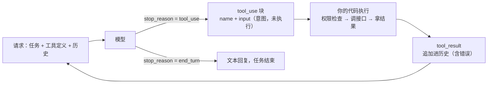

# 工具调用数据流：模型怎么"调"你的接口

上一篇的例子里，模型"调用了查天气"。这个说法有一个巨大的误导：**模型没有调用任何东西**。它只是输出了一段结构化的文本，说"我想调查天气，参数是明天下午"。真正发请求、拿结果、传回去的，是你的代码。

这条数据流是一切 Agent 的地基。这篇把它拆到每一个字段，看清楚模型做了什么、你的代码做了什么。

---

## 第一步：告诉模型有哪些工具

工具在请求里以 **schema** 的形式声明，每个工具三部分：

```json
{
  "name": "get_weather",
  "description": "查询指定城市、指定日期的天气预报。日期用 YYYY-MM-DD。",
  "input_schema": {
    "type": "object",
    "properties": {
      "city": { "type": "string", "description": "城市名" },
      "date": { "type": "string", "description": "日期，YYYY-MM-DD" }
    },
    "required": ["city", "date"]
  }
}
```

- **name**：工具的标识，模型调用时用它指明调哪个
- **description**：给模型看的说明。**这是一段 prompt**，模型靠它判断什么时候该用这个工具、参数怎么填。写得含糊，模型就用错
- **input_schema**：参数的 JSON Schema，模型按这个结构生成参数

工具定义和 system 指令、对话历史一起送进模型，是第 13 篇说的上下文六块之一。它默认每次请求都要带上，几十个工具的定义可能占几千上万 token——这是 Agent 成本高的一个原因。现在有的 API 支持把工具定义延迟加载、按需检索，加上前缀缓存，这块开销已经能压下来。

---

## 第二步：模型返回"调用意图"

模型读完任务和工具定义，如果判断需要调工具，响应里会出现一个 **tool_use 块**，而不是文本（各家字段名略有不同，下面用其中一家的写法）：

```json
{
  "type": "tool_use",
  "id": "call_01",
  "name": "get_weather",
  "input": { "city": "上海", "date": "2026-09-15" }
}
```

同时 stop_reason 是 tool_use——第 09 篇说过要检查这个字段，这里就是它最重要的用途：**告诉你的代码"模型想调工具，轮到你了"**。

再强调一遍：到这一步，什么都没发生。没有 HTTP 请求发出去，没有数据库被查询。模型只是生成了一段 JSON，表达"我想这么做"。**模型没有手，你的代码才是手。**

这个设计是刻意的：模型运行在厂商的服务器上，你的接口在你的内网里，模型碰不到。所有执行都必须经过你的代码，这也意味着**所有权限控制、审计、拦截都有唯一的落点**——在你执行之前。

---

## 第三步：你的代码执行，把结果回传

你的代码解析 tool_use 块：按 name 找到对应的函数，用 input 作为参数执行，拿到结果。然后把结果作为一条新的 user 消息追加到历史，再次请求模型：

```json
{
  "role": "user",
  "content": [
    {
      "type": "tool_result",
      "tool_use_id": "call_01",
      "content": "上海 2026-09-15：晴，最高 26 度，降水概率 5%"
    }
  ]
}
```

- **tool_use_id** 对应上一步的 id，模型靠它知道这个结果是哪次调用的
- **content** 是结果，字符串或者结构化内容都可以
- 注意角色是 user：工具结果以"非模型一侧"的身份进入对话（第 09 篇）

**执行失败也要回传**。接口超时、参数不合法、权限不足——把错误信息作为 tool_result 传回去（有的 API 有专门的错误标记，没有的就把错误写进结果内容里），让模型知道失败了、为什么失败。模型看到错误会调整：换参数重试、换个工具、或者告诉用户做不到。**吞掉错误、假装工具返回了空**，是最常见的错误做法，模型会基于空结果继续，越走越偏。

---

## 第四步：模型基于结果继续

模型读到工具结果，做下一个判断：再调一个工具、还是任务完成生成回复。回到第二步或者结束。

完整的一轮：



---

## 几个工程细节

**并行调用**。模型一次响应里可能返回多个 tool_use 块（同时查三个城市的天气）。你的代码可以并行执行，然后把**全部结果放在同一条 user 消息里**回传——分成多条消息回传，模型会逐渐"学会"不再并行调用。只读的工具（查询）适合并行；改状态的工具（写入、删除）串行执行，避免冲突。

**参数校验**。模型生成的参数可能不合法：日期格式错、枚举值不在范围内。主流 API 现在支持给工具开 strict 模式，保证参数严格符合 schema（第 15 篇的约束解码用在工具参数上）。但 schema 保证的是格式，业务合法性（这个用户有没有权限查这个城市）还是要你校验。

**工具的返回要精简**。接口返回的原始 JSON 可能几十 KB，全部塞回上下文是浪费，还稀释注意力。回传前裁剪成模型需要的字段，大结果分页。**工具的输出设计和输入设计同样重要**——它决定了模型下一步看到什么。

**描述是最重要的 prompt**。模型用错工具、参数填错，八成是 description 写得不清楚。写清楚：这个工具做什么、什么情况下用、什么情况下不用、参数的格式和含义、返回什么。把它当接口文档写，读者是一个聪明但不了解你系统的人。

---

## 主流 API 的几种形态

上面讲的是**客户端工具**：你定义、你执行。还有一类**服务端工具**：厂商定义、厂商执行——网页搜索、代码执行、文件检索这类通用能力，请求里声明一下，模型调用时厂商在自己的环境里执行，结果直接出现在响应里，不经过你的代码。

两者可以混用。服务端工具省事，但你看不到执行过程、控制不了权限；涉及你自己系统的操作，必须是客户端工具。

今年又多了一层：厂商把**整个循环**也托管了——会话、压缩、子 Agent 都在厂商侧跑，你只提供工具，执行仍可以留在你自己的环境里。下一篇讲的循环设计，在这种形态下变成了配置项。

---

## 收个尾

工具调用的数据流就四步：声明工具 → 模型返回意图 → 你执行并回传结果 → 模型继续。理解了"模型只表达意图、执行权在你"，Agent 的安全模型、权限设计、审计方案就都有了落点——全部在第三步。下一篇把这四步放进循环里，讲循环怎么设计才不失控。

---

**🎯 反直觉一问**

上一篇答案：**B**——模型自己决定调什么工具、调几次，控制流在模型手里，这才是 Agent；A 是工作流，C 是问答。

模型的响应里出现了 tool_use 块，说要调「查天气」接口。这时候查天气接口已经被调用了吗？

A. 已经调了，结果马上会返回
B. 没有，这只是模型的"调用意图"，要你的代码去执行
C. 厂商的服务器替你调了

下方投票选一个，想说理由的评论区聊，下一篇揭晓。
