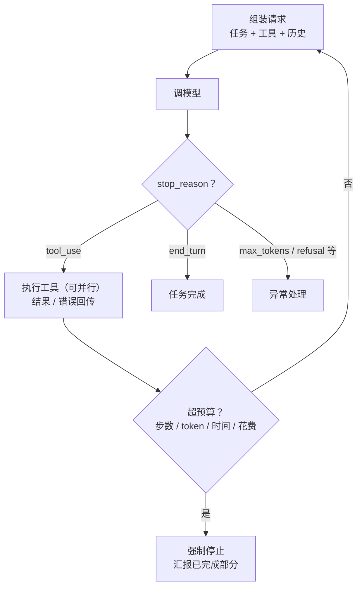

# Agent Loop：循环怎么设计，怎么不失控

前两篇把"一步"讲清楚了：模型返回意图，代码执行，结果回传。Agent 就是把这一步放进循环。循环本身只有十几行代码，但**怎么让它停、怎么让它不跑偏、怎么让它不烧钱**，是 Agent 工程的核心。

这篇讲循环的设计：骨架、终止条件、失败处理、并行、以及跑偏的典型模式和对策。

---

## 循环的骨架

最简形态：

1. 组装请求：任务 + 工具定义 + 到目前为止的历史
2. 调模型
3. 看 stop_reason：是 tool_use 就执行工具、把结果追加进历史、回到第 1 步；是 end_turn 就结束
4. 每一圈检查硬限制：步数、token、时间、花费，超了强制停

这个骨架早年叫 ReAct（Reasoning + Acting：想一步、做一步）。现在的模型把"想"内化到了思考模式里，循环本身简化了——不需要在 prompt 里要求模型先写"Thought:"再写"Action:"，直接让它返回工具调用就行。骨架没变，变的是模型在每一圈里的可靠性。

主流 SDK 现在都提供了这个循环的封装：你只写工具函数，SDK 负责调模型、执行、回传、判停。生产环境要的是**每一圈都有钩子**——审批、拦截、记账、改写结果。Agent 框架级的 SDK 一般都带这套钩子；最薄的那层"工具循环"封装往往没有，那就自己写循环。

---

## 终止条件：模型说停，和你说停

**正常终止**：模型判断任务完成，返回文本而不是 tool_use。这是唯一的"成功"路径。

**强制终止**，四个硬限制，缺一不可：

- **最大步数**：简单任务几步，编程任务可能几十步。设一个和任务类型匹配的上限，超了就停。这是防死循环的最后一道闸
- **token / 花费预算**：每一圈的成本随历史增长而增长（第 10 篇），一个跑偏的 Agent 一小时能烧掉一天的预算
- **时间上限**：用户等待的场景要有超时；后台任务也要有，否则挂住的工具调用会让循环永远等下去
- **上下文上限**：历史逼近窗口就要压缩或停（第 25 篇）。有的 API 已经能在服务端自动压缩，但阈值和保留什么仍要你定

有的 API 现在支持把预算告诉模型（"你还剩多少 token"），让它自己规划节奏、在预算内收尾，而不是被硬掐断。硬限制依然要有，这是兜底。

**强制终止时要有交代**：把已经完成的部分汇报出来，而不是直接报错。跑了十五步做了一半的任务，"做到这里了，剩下的是 X"比"超时失败"有用得多。

---

## 工具失败怎么处理

第 22 篇说过原则：**错误回传给模型，不吞、不崩**。展开几条：

- **可重试的错误**（超时、限流）：代码层先重试一两次，还不行再回传给模型。别让模型浪费一圈推理去决定"再试一次"
- **不可重试的错误**（参数错、权限不足、资源不存在）：直接回传，附上清楚的错误信息。模型会换参数、换工具或放弃
- **重试要有上限**。模型看到错误可能反复用同样的参数重试。代码层记录同一个工具同样参数失败的次数，超过两三次就在回传里明确说"这个操作已失败 N 次，请换方法或停止"
- **部分失败**：并行调了五个工具，两个失败。全部结果一起回传，成功的成功、失败的标错误，让模型自己决定怎么继续

---

## 并行工具调用

模型一圈可以返回多个工具调用。执行策略：

- **只读工具并行**：查询、搜索、读文件，互不影响，并行执行省时间
- **写操作串行**：改状态的操作按顺序执行，避免竞争和冲突
- **结果一次回传**：全部结果放在同一条消息里，顺序和调用顺序对应

工具定义里可以标注"只读"，让循环自动决定并行策略。

---

## 跑偏的典型模式

Agent 跑偏不是随机的，有几种反复出现的模式，每种都有对应的防线：

**原地打转**：同样的工具、同样的参数调了五次。防线：代码层检测重复调用，第二次就在回传里提示，第三次强制停。

**越搜越深**：搜索类任务，模型不断"再搜一下确认"，永远觉得不够。防线：搜索次数上限；system 里明确"信息足够回答就停止"；第 19 篇的混合策略。

**目标漂移**：跑到第二十步，模型在处理一个和原任务无关的分支。防线：每隔几圈把原始任务重新放进上下文；压缩历史时保留任务描述（第 25 篇的"锚点"）。

**幻觉执行**：模型在文本里写"我已经把文件删了"，但并没有返回 tool_use 块。防线：以实际的 tool_use 为准，文本里的"我做了 X"不算数；关键操作检查是否真的有对应的工具调用记录。

**权限越界**：模型调用了它"可以"但不该调的工具。防线：不是靠 prompt 说"不要删"，是**不给它删的工具**，或者删除类操作走审批钩子。

所有防线的共同点：**在代码层做，不依赖模型自觉**。模型是概率的，防线必须是确定的。

---

## 人在哪一步介入

不是所有 Agent 都全自动。按风险分三档：

- **全自动**：只读操作、可逆操作、影响范围小。跑完看结果
- **关键步骤审批**：写入、删除、对外发送、花钱的操作，循环在执行前暂停等人确认。SDK 的钩子就是干这个的
- **每步确认**：高风险场景，退化成 Copilot 形态（第 08 篇）

审批不是越多越好——每个审批点都是一次等待，把人变成瓶颈。原则是**按操作的不可逆程度分级**，而不是一刀切。

---

## 拆成子 Agent

任务复杂到几十步，单个循环的上下文会膨胀到影响判断（第 11 篇的注意力稀释）。成熟的做法是拆：一个协调者 Agent 把任务分解，每个子任务交给一个独立的子 Agent，**子 Agent 有自己干净的上下文**，跑完只把结论（几百到几千 token）回传给协调者。

另一种拆法是"交接"：把整个对话交给专门的子 Agent 接管，适合领域截然不同的分流场景。

好处是每个循环的上下文都短而专注，坏处是协调本身也是一层复杂度。规律：**单个循环的步数远超同类任务的常态、或者上下文持续上涨而任务还看不到头，就该考虑拆了**。第 13 篇的"隔离"说的就是这个。

---

**🎯 站队调研题**

上一篇答案：**B**——tool_use 只是模型表达的调用意图，什么都没执行，要你的代码去调接口再把结果传回去。

这道没有标准答案，想看看大家的实际情况：你们线上的 Agent，单次任务的最大步数设在多少？

A. 10 步以内
B. 10 到 50 步
C. 50 步以上或不限
D. 还没上 Agent

下方投票报一下，下一篇汇总。
