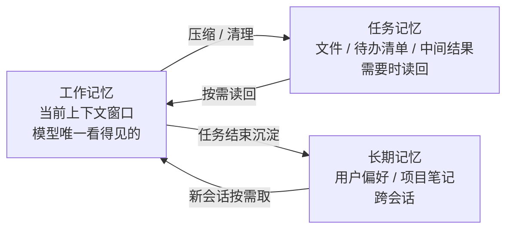

# 长任务和多轮对话：Agent 的记忆怎么管

一个跑几十步的 Agent，每一步的工具返回都追加进历史。第 11 篇算过账：上下文单调增长，成本线性涨，注意力被陈旧信息稀释，模型开始引用过期的中间结果。跑到第四十步，它可能已经忘了第三步确认过的约束。

这篇讲怎么管：上下文快满了怎么压、哪些东西该搬到上下文外面、跨会话的记忆怎么做、任务中断了怎么续。

---

## 先分清三种"记忆"

模型本身没有记忆（第 09 篇），所有"记住"都是工程实现。按存在的位置分三层：

**工作记忆**：当前请求的上下文窗口。模型真正"看得见"的只有这一层。容量有限、每 token 计费。

**任务记忆**：当前任务过程中产生的、需要跨步骤保留但不必每步都看的信息。中间结果、待办清单、已经验证过的事实。放在上下文外面，需要时读回来。

**长期记忆**：跨任务、跨会话的信息。用户偏好、项目背景、上次任务的结论。存在数据库或文件里，新会话开始时按需取。

管理记忆的核心动作只有一个：**决定什么留在工作记忆里，什么搬出去，什么时候搬回来**。

---

## 工作记忆满了：压缩和清理

两个动作，解决的问题不同：

**清理（Clear）**：把已经用完的内容删掉。典型对象是旧的工具返回——第五步读了一个大文件，模型已经从中提取了结论，原文没必要继续占着几千 token。清理不改变剩下的内容，只是删。

**压缩（Compact）**：把一段历史摘要成一段短文本。前二十步的来回变成"已完成：确认了 A、B；发现 C 不可行；当前进度：正在做 D"。压缩会丢细节，换来空间。

两个原则：

- **早做，别等满了**。实测上下文过了四分之一质量就开始下滑，不是撞到窗口才有问题。按阈值触发，而不是按"快满了"
- **保留锚点**。压缩时有一块内容永远不动：原始任务、硬约束、当前状态。丢了这些，模型压缩后就不知道自己在干什么——第 23 篇说的"目标漂移"，一半来自压缩丢了锚点

主流 API 现在提供了服务端版本：请求里开一个开关，超过阈值自动摘要旧历史；或者声明策略，自动清掉旧的工具返回和思考块。省了自己实现，但**压什么、留什么的判断依然是你的**——默认策略不知道你的任务里哪些是锚点。

一个工程细节：服务端压缩后，响应里会带一个压缩块，下次请求要原样带回，API 用它替换被压缩的历史。只取文本、丢掉这个块，压缩状态就丢了（第 09 篇"原样带回"的又一个例子）。

---

## 任务记忆：把东西搬到上下文外面

上下文不是唯一的存储。成熟的 Agent 普遍给模型一块**外部的草稿区**：

**文件**。给模型读写文件的工具，让它把中间结果、笔记、计划写到文件里，需要时再读。编程 Agent 的标配：它会自己维护一个进度文件，压缩历史后靠读这个文件恢复状态。

**待办清单**。任务开始时让模型列出步骤，每完成一步标记。这份清单是最好的锚点——压缩后读一眼就知道做到哪了。也是防跑偏的手段：清单之外的事，模型会意识到"这不在计划里"。

**结构化状态**。你的代码维护一个状态对象（已确认的事实、已产出的文件、当前阶段），每次请求把它渲染成一小段文本放进上下文。模型不用从几十步历史里重建状态，直接看摘要。

共同点：**上下文里只放"当前需要看的"，其余放外面按需取**。这是第 13 篇 Context Engineering 的"选择"动作在长任务里的具体形态。

---

## 长期记忆：跨会话

用户上次说过"回复用英文"、项目用的是某个框架、上个月那个任务的结论——这些要跨会话保留。

实现上是一个读写循环：

- **写**：任务结束时，让模型（或你的代码）提取值得保留的信息，存进记忆库。存什么要有规则——偏好、事实、结论存；过程细节不存
- **读**：新会话开始时，按用户或项目取出相关的记忆，放进 system 或第一条消息。全部塞进去会膨胀，按相关性筛（这里又回到了检索，第四章）
- **更新和过期**：偏好会变，事实会过时。记忆要能覆盖、能删，最好带时间戳

主流厂商开始提供托管的记忆工具：给模型一个记忆读写工具，存储由厂商管。适合快速起步；对数据有要求的自己实现。

一个常见误区是把长期记忆做成"把所有历史对话存下来"。那是日志，不是记忆。记忆是**提炼过的、可直接使用的结论**，不是原始记录。

---

## 断点续跑

长任务会中断：进程重启、超时、用户关了页面、审批等了一夜。要能从中断处继续，而不是从头再来。

需要三样东西：

- **持久化的历史**。每一圈的请求和响应落盘，包括工具调用和结果。历史只能追加、不能回头改（第 09 篇的签名规则），所以落盘是天然安全的
- **幂等的工具**。恢复时可能重放最后一步。写操作要幂等（同样的参数再执行一次不会重复写入），或者记录"已执行"的标记
- **可恢复的状态**。上面说的待办清单、状态对象、文件，都是持久化的。恢复时把它们和历史一起装回上下文，模型就能接着干

主流平台的托管 Agent 会话已经内置了这些：会话状态在服务端，断了重连就能续。自建的话，这三样是最低配置。

---

## 收个尾

Agent 的记忆管理，本质是在有限的窗口和无限的任务之间做调度：工作记忆只放当前需要的，任务记忆放在外面按需取，长期记忆跨会话沉淀，中断了靠持久化续。所有技巧都围绕一个事实——**模型每次只看得见上下文里的东西，你决定它看见什么**。

---

**🎯 三秒判断题**

上一篇答案：**B**——Function Calling 是模型侧表达调用的机制，MCP 是工具供给侧的标准，MCP 包在外面，两者不互相替代。

一个跑了三十步的 Agent，上下文已经占了窗口的一半，最好的做法是？

A. 换一个窗口更大的模型，继续跑
B. 把旧的工具返回清掉、早期历史摘要成一段，保留任务和约束不动
C. 直接删掉最早的十条消息

下方投票选一个，想说理由的评论区聊，下一篇揭晓。
