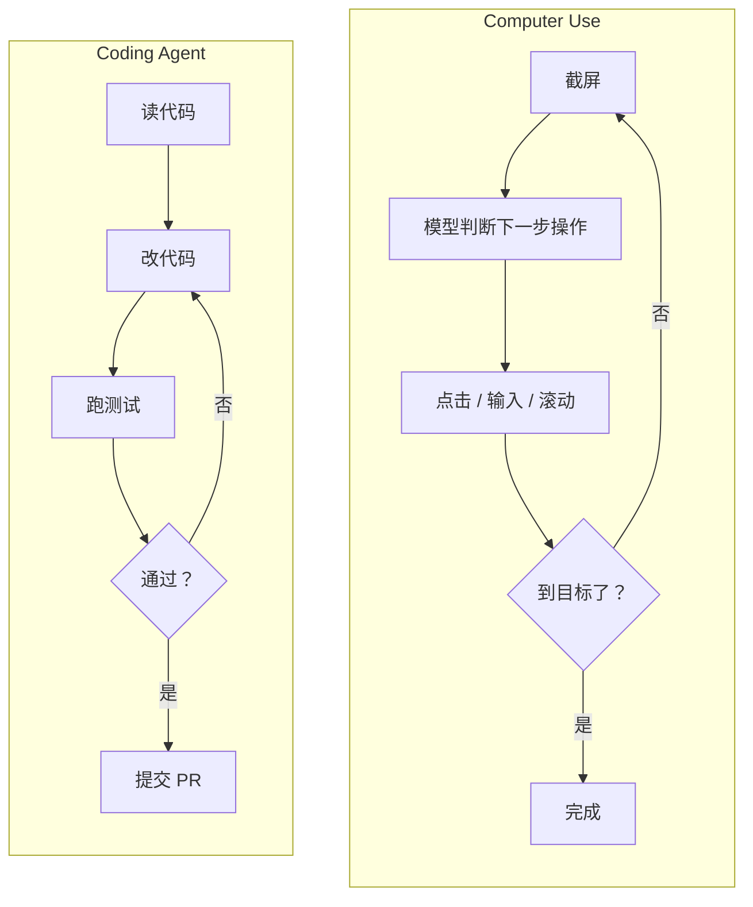

# Coding Agent 和 Computer Use：落地最深的两个形态

这一章前五篇讲的是通用机制。最后一篇看两个具体形态：**写代码的 Agent** 和 **操作电脑的 Agent**。一个是目前落地最深、最成熟的场景，一个是进步最快、也最容易被高估的场景。放在一起看，能看清"什么让 Agent 好用"。

---

## 为什么写代码是 Agent 最成熟的场景

编程 Agent 已经能独立完成"读需求 → 改代码 → 跑测试 → 修到通过 → 提交"的完整任务，自主运行几小时。它成为第一个大规模落地的 Agent 形态，不是因为写代码简单，而是因为这个场景有三个别的场景没有的条件：

**反馈闭环是自动的、精确的**。改完代码跑一下测试，通过还是失败，编译器和测试框架立刻告诉你，没有歧义。Agent 在循环里每一步都能拿到"做对了没有"的确定信号，错了就改，改了再试。第 23 篇讲的循环，在这里有一个完美的终止条件：测试全绿。

对比一下写文案：改完一版，好不好没有自动判据，只能靠人看。没有反馈闭环的任务，Agent 跑十步和跑一步的质量差不多，因为它不知道自己哪步做错了。

**工具是现成的、精确的**。读文件、写文件、grep、执行命令——这几个工具覆盖了写代码的全部动作，而且每个都是确定性的，返回精确。不像"发一封合适的邮件"那种工具，输入输出都模糊。

**训练数据最充足**。代码是互联网上结构最清晰、数量最大的语料之一，而且天然带着"问题 → 修改 → 结果"的配对（提交记录、issue、测试）。模型在这个领域的能力提升最快，专门针对编程任务的强化学习也最容易做——奖励信号就是测试通过率。

三个条件里，**反馈闭环**是决定性的。判断一个新场景适不适合 Agent，先问这个：**做完之后，能不能自动、准确地知道做对了没有？** 能，Agent 大概率能跑好；不能，先想办法造出这个反馈信号（自动校验、结构化检查、模拟环境），再上 Agent。

---

## 编程 Agent 的现状

评测上，主流模型在真实仓库修 bug 的基准（SWE-bench 系列）上，原版已接近饱和；更难的 Pro 版，厂商自报的头部成绩已过七成，第三方统一脚手架下要低一截。终端操作类基准的旧版头部已过九成，新出的更难版本又把分数打回六成上下——基准在追着模型跑。厂商按"能自主工作几小时到几天"来宣传。

落地形态分三档：

- **IDE 内的补全和对话**：Copilot 形态，人主导，每步可见
- **委托任务的 Agent**：给一个 issue 或需求描述，它在独立环境里改完提 PR，人审 PR。这是当前扩张最明显的形态
- **长时自主运行**：给一个大目标，跑几小时，中途自己规划、自己测试、自己修正。用于大规模重构、迁移这类任务

工程上要注意的：

- **隔离环境**。Agent 会执行命令，必须在沙箱或容器里跑，不能碰生产环境和真实凭证
- **反馈信号的质量决定上限**。测试覆盖率低的仓库，Agent 改对改错都是"测试通过"，它就会自信地交付错误代码。上 Agent 前先补测试
- **人审的位置**。PR 是天然的审核点。Agent 写、人审、CI 跑，这条流水线已经很成熟
- **成本要算清**。一个中等任务几十步、每步带着仓库上下文，token 消耗是问答的几十倍。用缓存（仓库上下文前缀稳定）和子 Agent（第 23 篇）控制

---

## Computer Use：模型操作图形界面

另一个形态：模型看屏幕截图，决定点哪、输什么、滚到哪，执行后再看新截图，循环。目标是让模型像人一样用任何软件——没有 API 的老系统、只有网页界面的第三方服务。

两个循环形状一样，差别在**反馈信号**：Coding Agent 的反馈是"测试通过 / 失败"，精确；Computer Use 的反馈是"新截图长什么样"，模型要自己判断操作有没有生效、到没到目标，这个判断本身会错。

---

## Computer Use 的现状与边界

**进步很快**。两年前这个能力刚发布时，标准桌面任务评测上模型只能完成一两成，一年前到四成，现在头部模型已经超过了普通人的完成率。厂商的旗舰模型都把它当核心能力宣传，商用产品也已正式上线。

**但边界很清楚**：

- **慢**。每一步都要截图、推理、操作，一个人几分钟做完的任务，模型要几十分钟。步数也比人多出一倍上下——它会点错、会绕路
- **贵**。每步一次带图片的模型调用，几十步下来成本远超同样的任务走 API
- **脆**。界面改版、弹窗、加载慢、分辨率不同，都可能让它迷路。评测集是标准化环境，真实环境比它乱得多
- **危险**。它能点任何按钮。误操作的代价和人误操作一样，但它没有人的"这个按钮看着不对劲"的直觉

所以第 08 篇的结论没变：**有 API 可调时，永远优先调 API**。Computer Use 是给"没有 API、又必须自动化"的长尾场景准备的，不是替代 API 的通用方案。适合低频、可撤销、有人盯着的流程；不适合高频、不可逆、无人值守的操作。

---

## 两个形态给的启示

把两个形态并排看，能提炼出判断"一个场景 Agent 能不能跑好"的三个问题：

1. **反馈信号是否自动且精确**？编程有测试，Computer Use 只有截图。前者能自我纠错，后者靠模型自己判断
2. **工具是否确定性**？读写文件是确定的，点击一个坐标的结果不确定
3. **失败的代价是否可控**？改错代码有 PR 审核兜着，点错按钮可能已经发出去了

三个问题答得越好，越适合全自动；答得越差，越需要人在循环里。这一章讲的所有机制——工具设计、循环控制、记忆管理——都是在这三个问题的约束下做工程。

第五章到此结束。下一章讲把 Agent 推上生产要过的五关：成本、延迟、可靠性、安全、评估。

---

**🎯 反直觉一问**

上一篇答案：**B**——清掉用完的工具返回、把早期历史摘要，但任务和约束这些锚点不动；换大模型只是推迟问题，直接删最早的消息会把任务描述一起删掉。

为什么写代码成了 Agent 落地最深的场景？

A. 因为代码任务比其他任务简单
B. 因为有测试和编译器这种自动、精确的反馈信号，Agent 每步都知道做对没有
C. 因为程序员最愿意尝鲜

下方投票选一个，想说理由的评论区聊，下一篇揭晓。第五章到此结束，下一篇进入生产上线。
